업데이트 : 2017 년 12 월 01 일 

## 소개


이 Lab은 `Oracle Developer Cloud`와 Container기반의 `Application Container Cloud Service`를 사용하여 `DevOps` 자동화 과정의 핵심 부분인 `CI(Continuous Integration)` / `CD (Continuous Delivery)` 실습을 위한 Lab입니다. 

## 목표


- 외부 Git 저장소에서 코드 가져 오기 
- Developer Cloud Service 및 Oracle Application Container 클라우드 서비스를 사용하여 프로젝트 빌드 및 배포 

## 필수 아티팩트


- 강사가 제공한 각자에게 할당된 Oracle Public Cloud 계정을 확인하세요. 

## 특별주의 사항

- 복사하여 붙여 넣을 때 주의하십시오. 복사한 내용의 *이전*이나 *이후*에 **공백**을 넣게 되면 오류가 발생할 수 있습니다. 

# 마이크로 서비스 만들기 (Front 서비스)

## 초기 Git 저장소 생성


- 오라클 클라우드 서비스 포탈(https://cloud.oracle.com)에 접속합니다.

- 상단 메뉴의 "Sign In" 메뉴늘 클릭합니다.
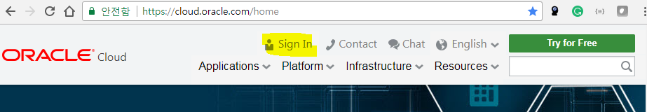
 
- 첫번재 리스트 박스에서 `Traditional Cloud Account`를 선택하고, 두번째 데이터 센터 선택 리스트 박스에서 `부여 받은 클라우드 계정의 데이터 센터`를 선택하여 `My Services` 버튼을 클릭합니다.
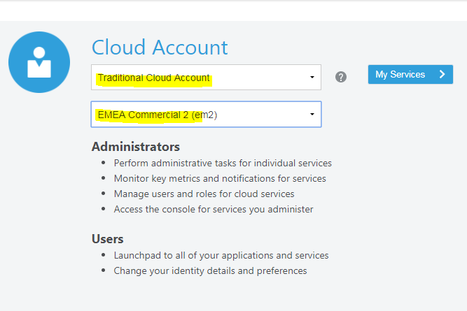

- Identity Domain 명 입력 화면에서 각자 부여받은 클라우드 계정의 Identity Domain 명을 입력하고 `Go`를 클릭합니다.
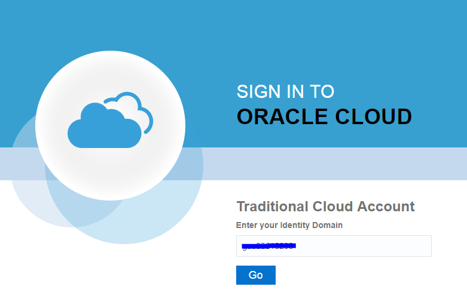

- 부여 받은 클라우드 계정의 ID와 패스워드를 입력하고 `Sign In`을 클릭합니다.

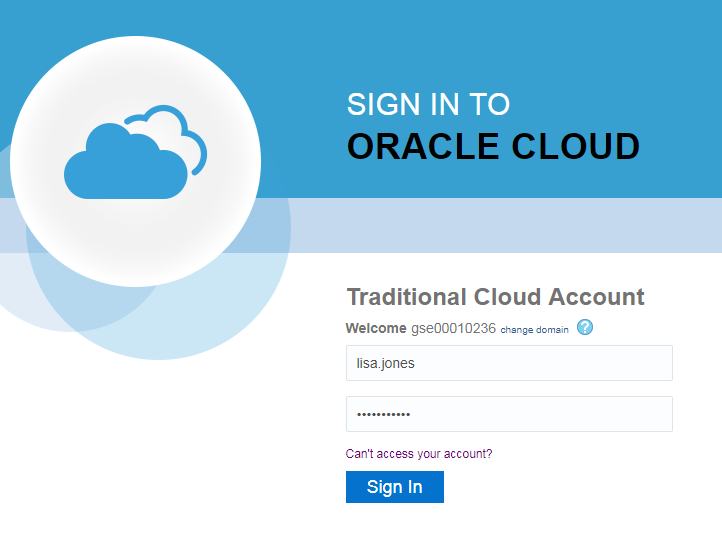

- 로그인 후에 My Services Dashboaard로 이동 됩니다. 대시보드 내의 가용 서비스들 중에 developer####으로 되어있는 서비스를 찾아 우측 하단의 햄버거 메뉴를 클릭하면 `Open Service Console` 메뉴가 나옵니다. 개발자 클라우드 서비스 콘솔로 이동합니다. 

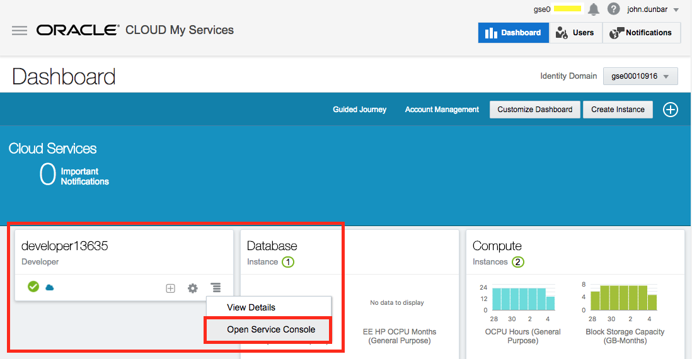


- Developer Cloud에 접속하면 프로젝트가 생성되어 있습니다. 강사에게 부여받은 프로젝트를 선택하여 해당 프로젝트로 이동합니다. (예: `Project`**01**) 

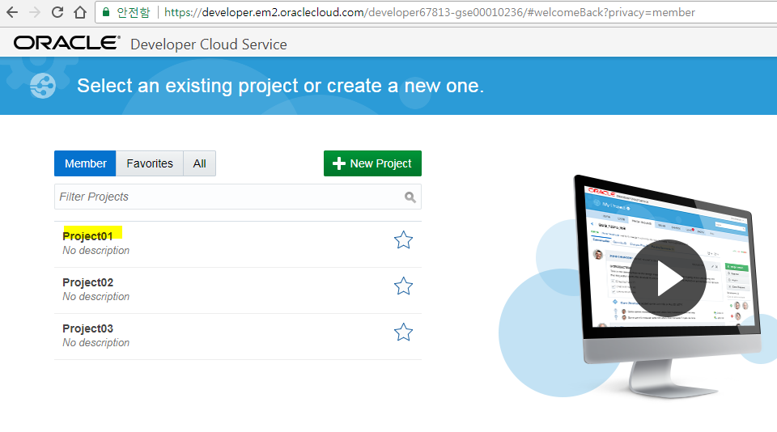


-. 이미 Developer Cloud 페이지에 접속되어 있는 경우왼쪽 탐색 패널의 `Project`를 클릭하여 프로젝트 기본 페이지로 이동할 수 있습니다.

-. **REPOSITORIES**섹션의 오른쪽에서 **New Repository**를 클릭하여 새로운 Git 저장소를 만듭니다.

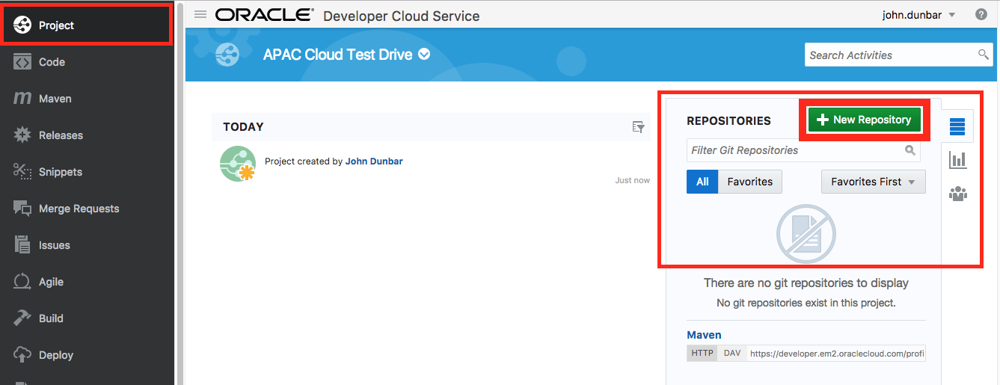

- 새 저장소 마법사에서 다음 정보를 입력하고 **Create**을 클릭합니다. 

	- **Name:** `Rep##` -- 부여받은 Repository명을 입력합니다.
	- **Description:** `Microservice to provide UI Service`
	- **Initial content:** `Import existing repository`
	- **Enter the URL:** `https://github.com/pcdavies/JETTwitterQuickStart.git`


```diff
- 복사해서 붙여넣기를 할 때 불필요한 스페이스가 들어갈 수 도 있으니 주의하시기 바랍니다.
```


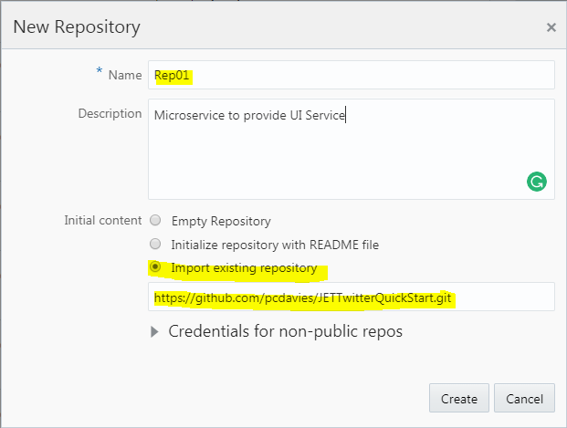


- 기존 저장소를 기반으로하는 개발자 클라우드 서비스 내에 저장된 새로운 Git 저장소를 만들었습니다 

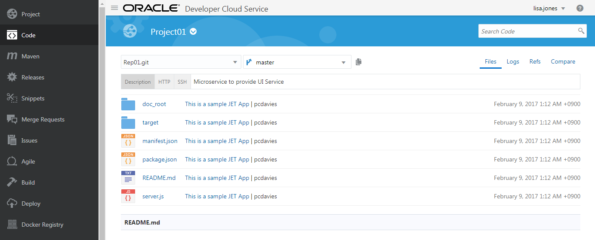


## 기본 빌드 및 배포 프로세스 만들기

개발자 클라우드 서비스에서 관리하는 Git Repository에 소스 코드가 있으므로 마스터 분기를 커밋 할 때마다 트리거되는 빌드 프로세스를 만들어야합니다.  

### 기본 빌드 프로세스 만들기


- 탐색 패널에서 **Build**를 클릭하여 빌드 페이지에 액세스하고 **[+ New Job]**을 클릭하십시오. 

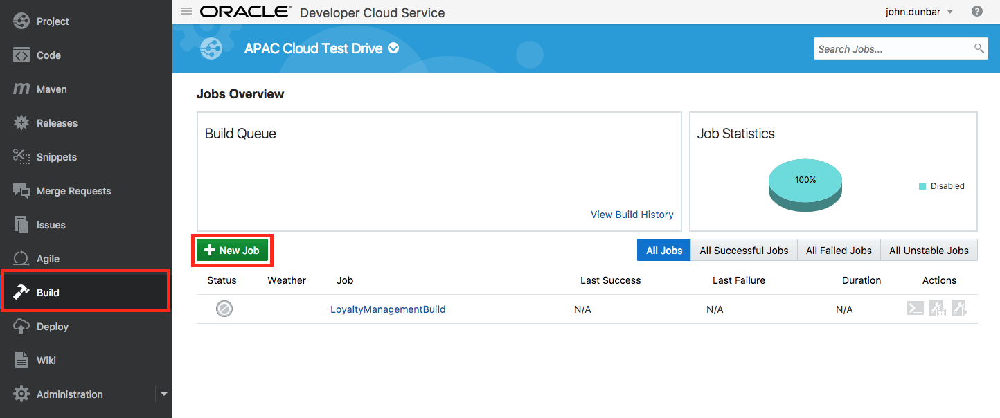


- New Job (새 작업) 팝업 창에서 Job Name에 대해 다음 처럼 입력하고 **Save**를 클릭하십시오. 
	- **Job Name:** `Rep##_build` -- 부여받은 Repository명을 prefix로 사용합니다.

```diff
- 복사해서 붙여넣기를 할 때 불필요한 스페이스가 들어갈 수 도 있으니 주의하시기 바랍니다.
```


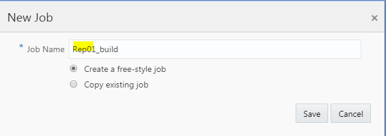


- 이제 작업 구성 화면에 배치됩니다. 

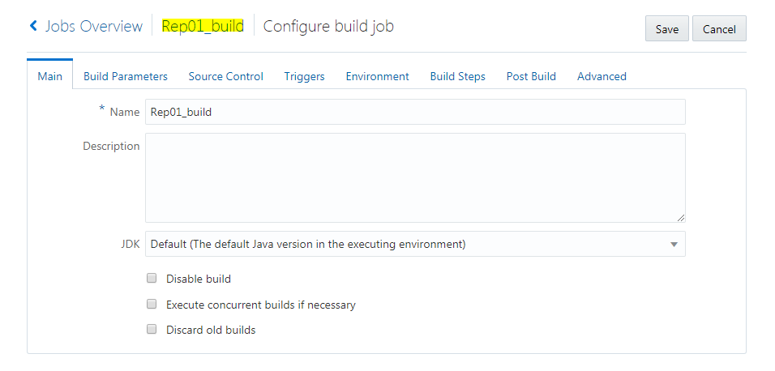


- **Source Control**탭을 클릭하십시오.
**Git** 라디오 버튼을 선택하십시오. 
리포지토리 섹션의 URL 드롭 다운에서 **Rep##.git**(`각자 생성한 Repository 를 선택해야 합니다. ## 부분 번호확인 필수`) 를 선택하십시오. 

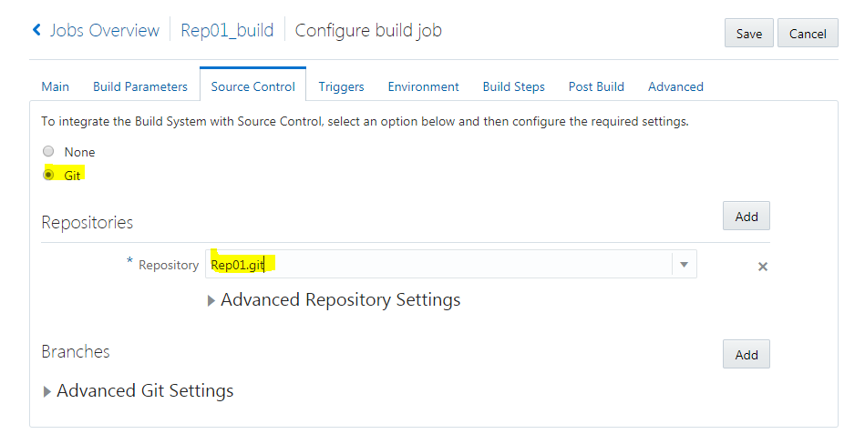


- **Triggers**탭을 클릭하십시오. **Based on SCM polling schedule**를 클릭하십시오.

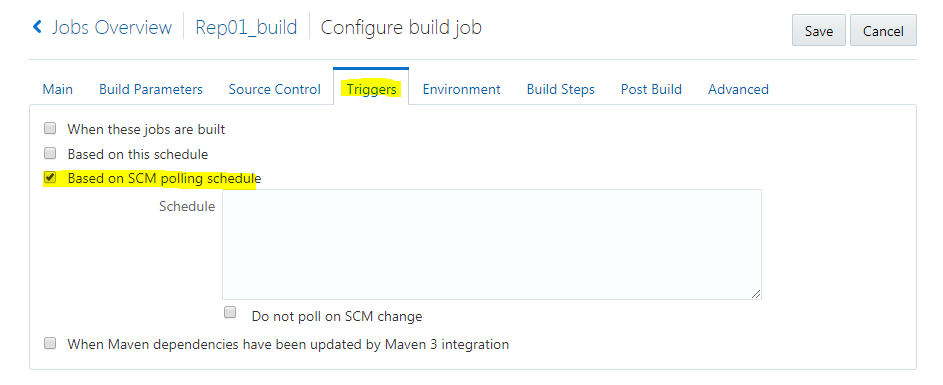


- **Build Steps**탭을 클릭하고**Add Build Step**를 클릭 한 다음 **Execute shell**을 선택합니다. 

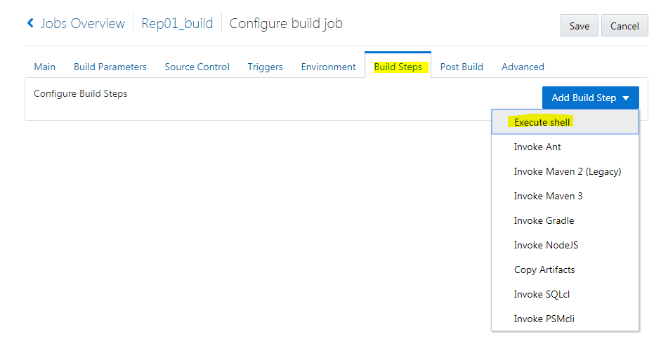


- Command textarea에 다음을 입력하십시오 :`npm install` 

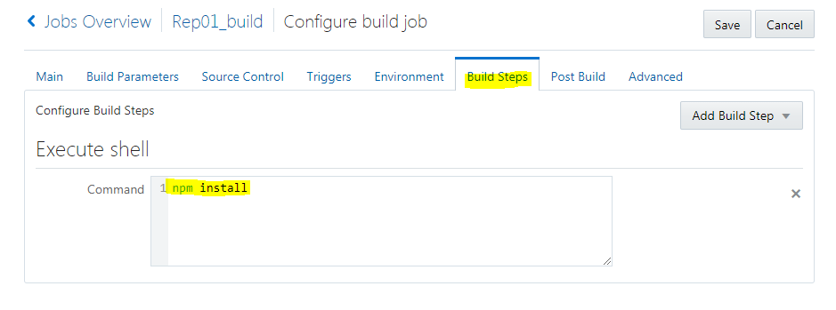


- **Post Build**탭을 클릭하십시오. **Archive the artifacts**을 ​​선택하십시오. 아카이브 할 파일에`**/target/*`을 입력하고 압축 유형으로 **GZIP**가 선택되어 있는지 확인하십시오. 

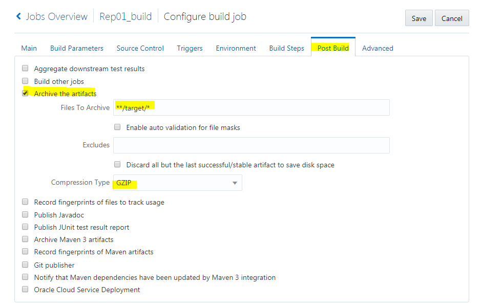


- **Save**을 클릭하여 구성을 완료하십시오. 

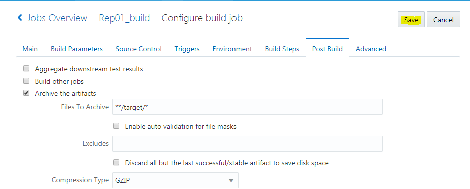


- 빌드는 1-2 분 내에 자동으로 시작됩니다. 자동으로 시작되지 않으면 **[Build Now]**버튼을 클릭하십시오. 

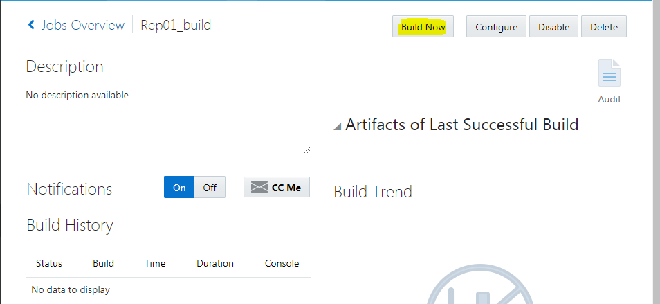


- 상태는 다음 다이어그램과 유사하게 바뀝니다. 

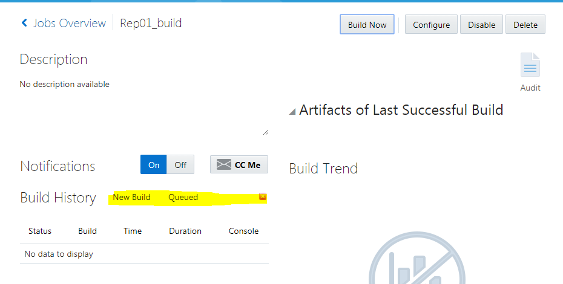


빌드 작업을 시작하려면 몇 분 정도 기다려야합니다. 

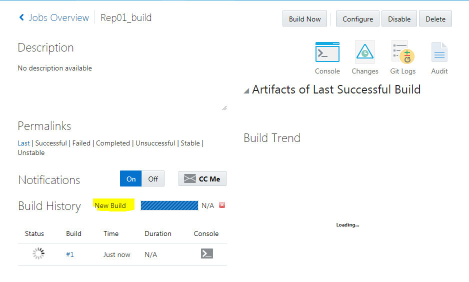


- 빌드가 완료 될 때까지 몇 분이 소요됩니다. 다음 단계로 진행하기 전에 빌드가 완료 될 때까지 기다리십시오 - **배포 구성을 생성하기 위해 빌드 아티팩트가 필요하므로**. 

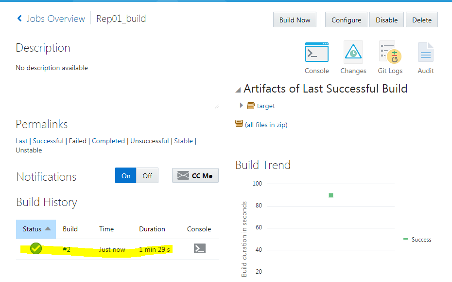


### 기본 배포 프로세스 만들기 


- **Deploy**를 클릭하여 배포 페이지에 액세스하고 **[+ New Configuration]**버튼을 클릭하십시오. 

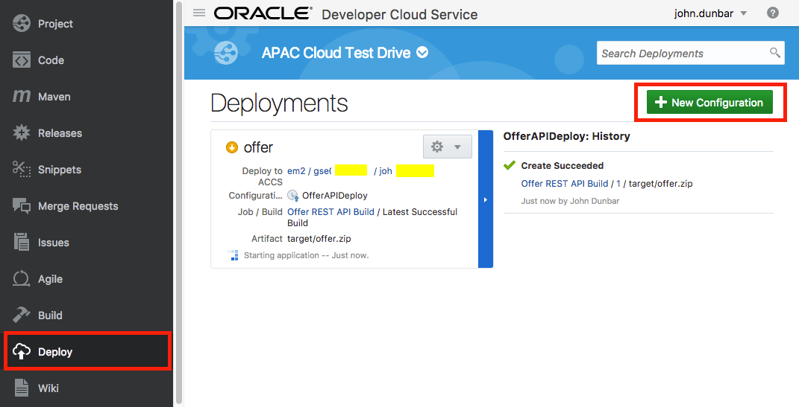


- 다음 데이터를 입력하십시오. 

	- **Configuration Name:** `a##` (예 : a01)
	- **Application Name:** `a##` (예 : a01) `## 부분의 번호룰 Rep## 번호와 같게 생성하세요. 할당 받은 번호를 사용합니다.` 


```diff
- 복사해서 붙여넣기를 할 때 불필요한 스페이스가 들어갈 수 도 있으니 주의하시기 바랍니다.
```


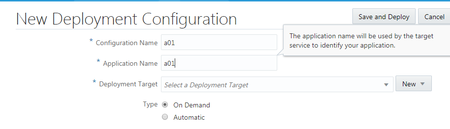


- **Deployment Target**의 오른쪽 옆에있는 **[New]**버튼을 클릭하고 **Application Container Cloud ...를 선택하십시오.**

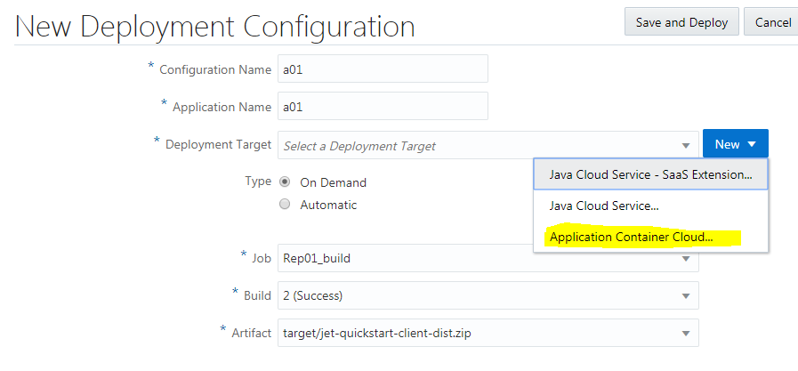


- 다음 정보를 입력하고 **Test Connection**를 클릭하십시오. 

	- `부여 받은 클라우드 계정 정보를 사용합니다.`
	- **Data Center:** `your datacenter, e.g. em2, em3, etc`
	- **Identity Domain:** `your identity domain`, e.g. gse00012345, etc
	- **Username:** `username to login to MyService`, e.g. lisa.jones, etc - that is the username you are using.
	- **Password:** `password of the cloud user`, that is the password you are using


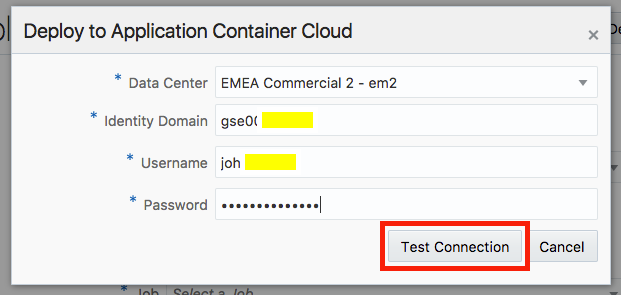


- 성공하면 **[Use Connection]**버튼을 클릭하십시오. 

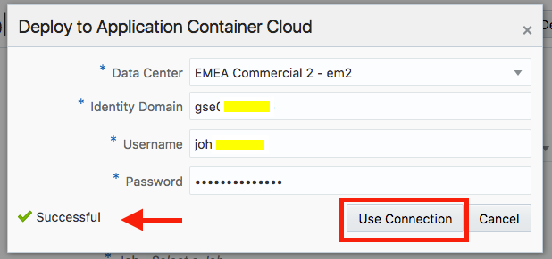


- Application Container Cloud Service 속성에서 다음을 설정합니다. 

	- **Runtime** to `Node`
	- **Subscription** to `Hourly`
	- **Type**에서 `Automatic`으로 설정하고 Deploy stable build only **체크**


**런타임이 Node 인지 다시 한번 확인**

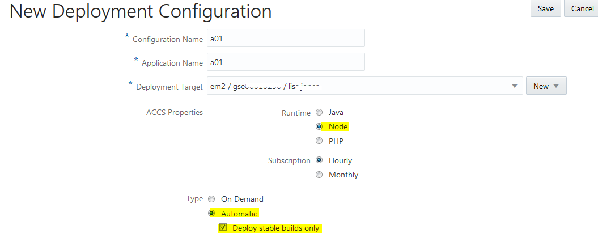


- **Job**에서 선택하십시오.이 이름은 위의 빌드 작업과 일치해야합니다 (예 :`Rep##_build`). 

- **Artifact**에서 선택하십시오.이 이름은 위의 아카이브 아티펙트와 소스 코드의 package.json과 일치해야합니다 (예 :`target/jet-quickstart-client-dist.zip`). 

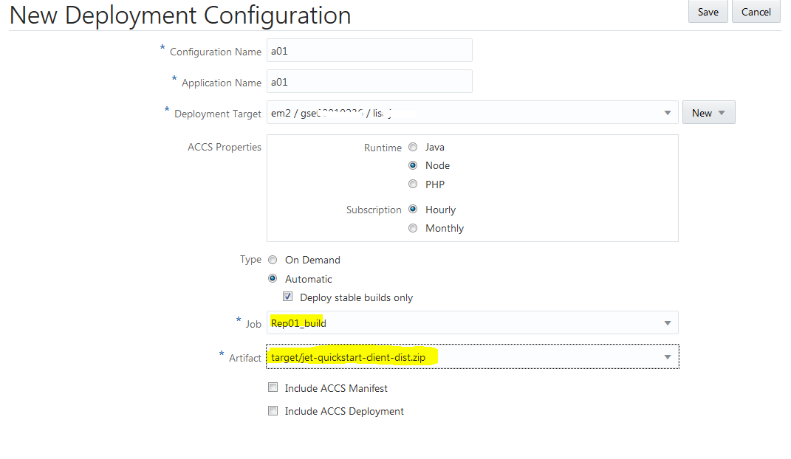


- **Include ACCS Deployment**상자를 체크하고 다음 json을 추가하십시오. 

```json
{
	"memory":"1G",
	"instances":"1"
}
```

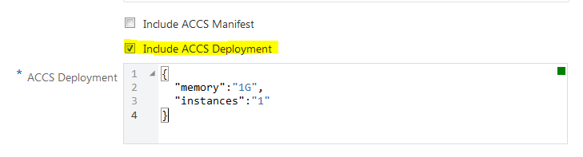

- 위의 사항을 확인하고 **Save** 버튼을 클릭합니다.

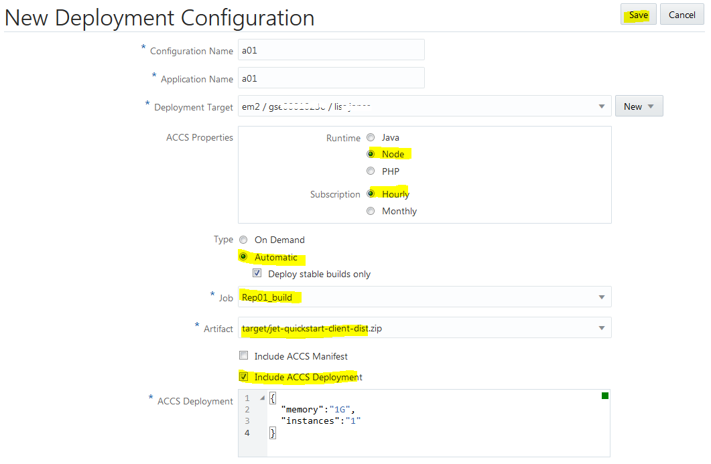

- 기어 마크가 있는 아이콘을 클릭한 다음 **Start** 를 누릅니다.

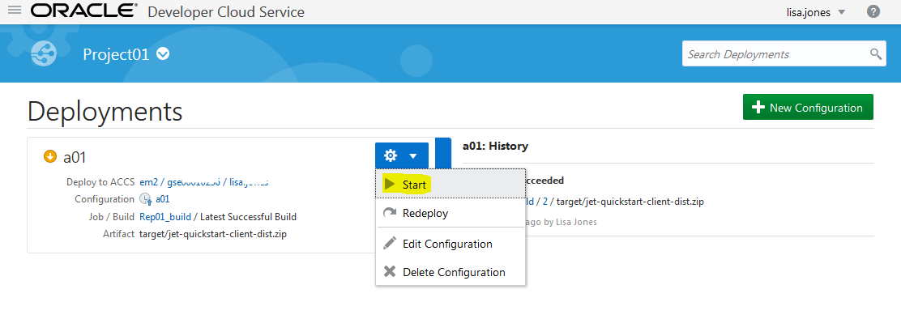

- 배포하는 작업이 큐에 들어갈 것입니다. 조금 기다리면 **Starting application** 메시지가 **Last deployment succeeded**로 바뀔 것입니다. 만약 배포작업이 실패하면 도움을 요청하십시오.

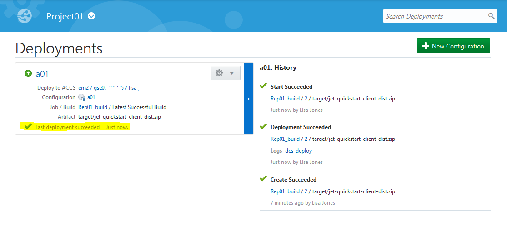

## Login to Oracle Application Container Cloud Service

- Lab 초반의 Cloud 로그인 단계를 거쳐 클라우드의 MyService 페이지로 이동합니다. 여기서 **Dashboard** 화면이 보이도록 위치 시킵니다.

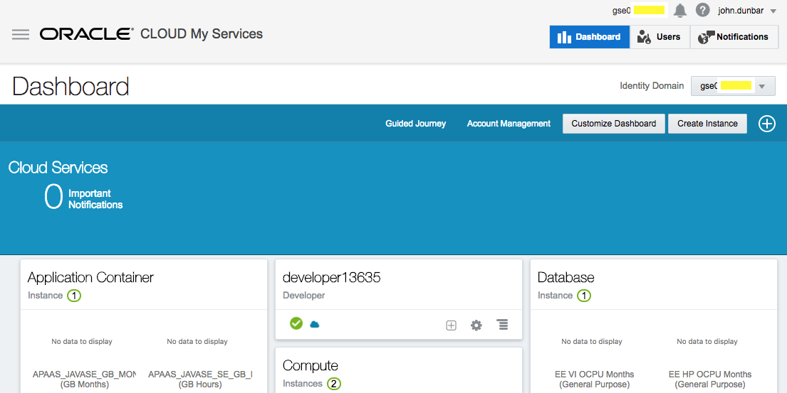

- Application Container Cloud Service (ACCS) 의 햄버거 버튼을 누르고 **Open Service Console** 를 선택하십시오.

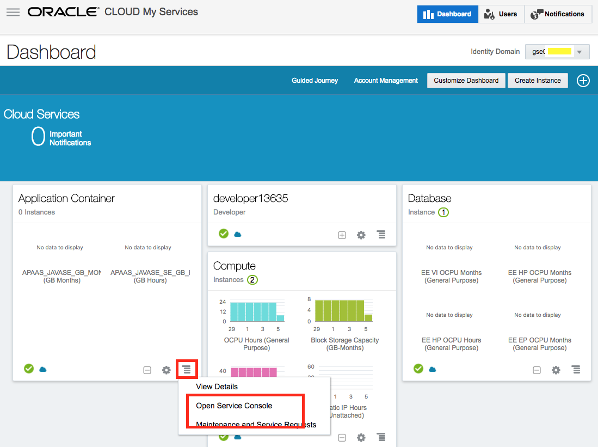

- ACCS Service Console 이 보여질 것입니다. 그리고 **a## (예 : `a01`)** 라는 새로운 애플리케이션이 배포된 것을 볼 수 있습니다.

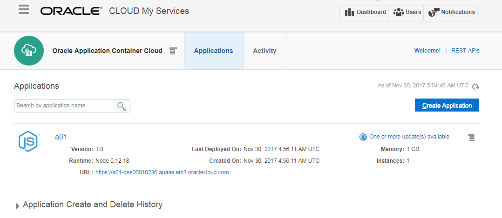

##  Verify the Working Service

- 애플리케이션 패널에서 애플리케이션에 대한 URL을 볼 수 있습니다. 예를들면 https://a##-{your-identity-domain}.apaas.{your-data-center}.oraclecloud.com

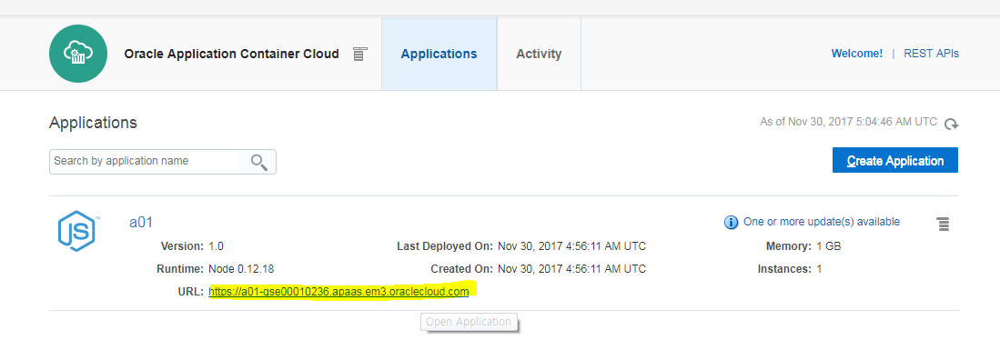

- 링크를 클릭하여 해당 url을 엽니다. 다음과 같이 애플리케이션이 정상적으로 브라우징 되면 성공입니다.

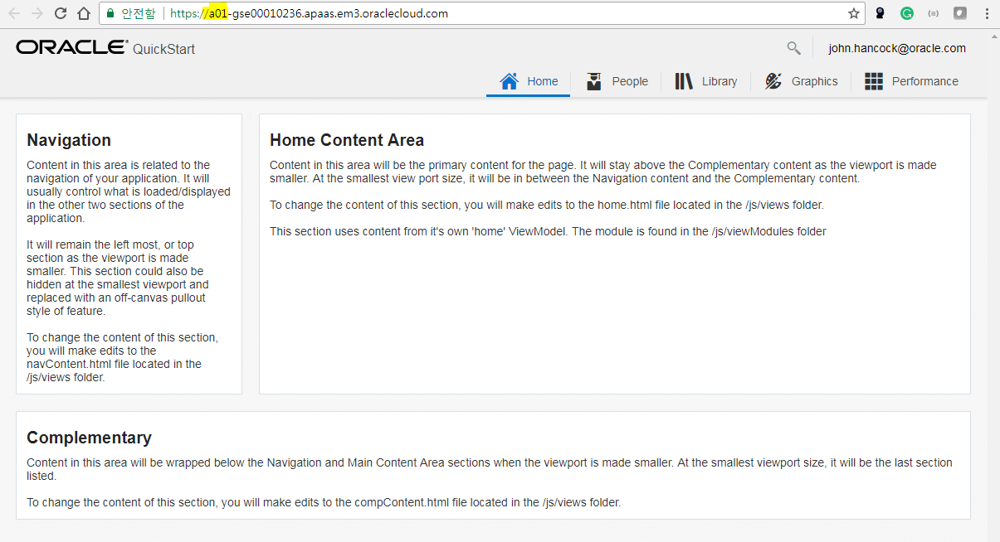


# 축하합니다. 첫 마이크로 서비스가 완성되었습니다. 

[이제 다음 Lab으로 이동합니다.](../02_DevOpsLab.md)

[첫 화면으로 이동합니다.](../README.md) 