업데이트 : 2017 년 12 월 01 일 

## 0.1 소개


이 Lab은 Oracle Developer Cloud와 Container기반의 Application Container Cloud Service를 사용하여 DevOps 자동화 과정의 핵심 부분인 CI(Continuous Integration) / CD (Continuous Delivery) 실습을 위한 Lab입니다. 

## 0.2 목표


- 외부 Git 저장소에서 코드 가져 오기 
- Developer Cloud Service 및 Oracle Application Container 클라우드 서비스를 사용하여 프로젝트 빌드 및 배포 

## 0.3 필수 아티팩트


- 다음 실습에서는 귀하가 직접 신청하거나 강사가 제공한 Oracle Public Cloud 계정이 필요합니다. 
- **이전 Lab**에서 로컬 컴퓨터의 IDE 환경 및 GIT 클라이언트. 이 Lab에서는 로컬 호스트 컴퓨터에서 Brackets 편집기를 사용한다고 가정합니다. **Brackets Editor 설치에 대한 자세한 내용은 이전 Lab**에서 다루었으며 [here](../Java%20Apps/brackets.md)을 찾을 수도 있습니다. 

## 0.4 특별주의 사항

- 복사하여 붙여 넣을 때 주의하십시오. 복사한 내용의 *이전*이나 *이후*에 **공백**을 넣게 되면 오류가 발생할 수 있습니다. 

# 1. 제안 REST API 마이크로 서비스 만들기

## 1.1 초기 Git 저장소 생성 - REST API 제공


1. 아직 수행하지 않았다면 개발자 클라우드 서비스에 로그인하십시오. Cloud Dashboard에 있는 경우 개발자 클라우드 서비스 햄버거 메뉴를 사용하여 DevCS로 이동할 수 있습니다. 


2. 개발자 클라우드 서비스 방문 페이지에는 이전 Lab에서 생성 한 프로젝트가 표시되어야합니다. 프로젝트 이름을 클릭하고 프로젝트 기본 페이지로 이동하십시오. 


3. 이미 개발자 클라우드 서비스에 가입되어있는 경우 왼쪽 탐색 패널의 `Project`를 클릭하여 프로젝트 기본 페이지로 이동할 수 있습니다.


4. **REPOSITORIES**섹션의 오른쪽에서 **New Repository**를 클릭하여 새로운 Git 저장소를 만듭니다. 

5. 새 저장소 마법사에서 다음 정보를 입력하고 **Create**을 클릭합니다. 

	- **Name:** `OfferMicroservice`
	- **Description:** `Microservice to provide REST API of Offer Details`
	- **Initial content:** `Import existing repository`
	- **Enter the URL:** `https://github.com/APACTestDrive/OfferMicroservice.git`


```diff
- 복사해서 붙여넣기를 할 때 불필요한 스페이스가 들어갈 수 도 있으니 주의하시기 바랍니다.
```


6. 기존 저장소를 기반으로하는 개발자 클라우드 서비스 내에 저장된 새로운 Git 저장소를 만들었습니다 

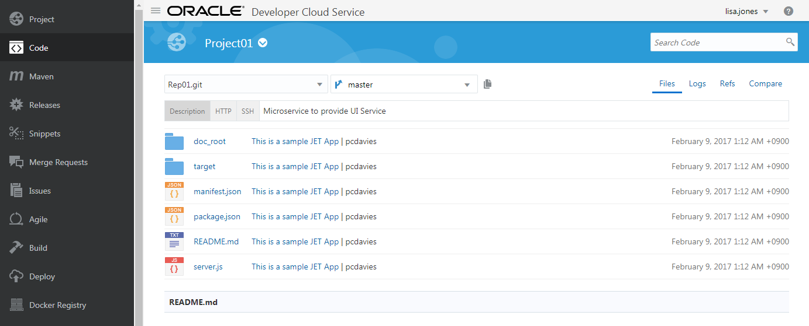


## 1.2 기본 빌드 및 배포 프로세스 만들기 - REST API 제공

개발자 클라우드 서비스에서 관리하는 Git Repository에 소스 코드가 있으므로 마스터 분기를 커밋 할 때마다 트리거되는 빌드 프로세스를 만들어야합니다. 이 섹션에서는 **shell script** 빌드 프로세스를 설정합니다. 

### 1.2.1 기본 빌드 프로세스 만들기 - REST API 제공


1. 탐색 패널에서 **Build**를 클릭하여 빌드 페이지에 액세스하고 **[+ New Job]**을 클릭하십시오. 


2. New Job (새 작업) 팝업 창에서 Job Name에 대해 Offer REST API Build를 입력하고 **Save**를 클릭하십시오. 

```diff
- 복사해서 붙여넣기를 할 때 불필요한 스페이스가 들어갈 수 도 있으니 주의하시기 바랍니다.
```


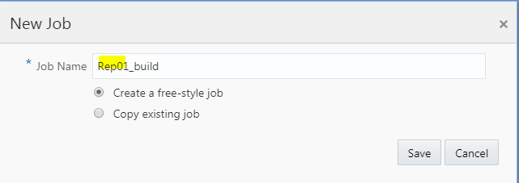


3. 이제 작업 구성 화면에 배치됩니다. 


4. **Source Control**탭을 클릭하십시오.
**Git** 라디오 버튼을 선택하십시오. 
리포지토리 섹션의 URL 드롭 다운에서 **OfferMicroservice.git**를 선택하십시오. 


**참고 :** Offer REST API Microservice의 Git 저장소를 선택해야합니다. 

5. **Triggers**탭을 클릭하십시오. **Based on SCM polling schedule**를 클릭하십시오.

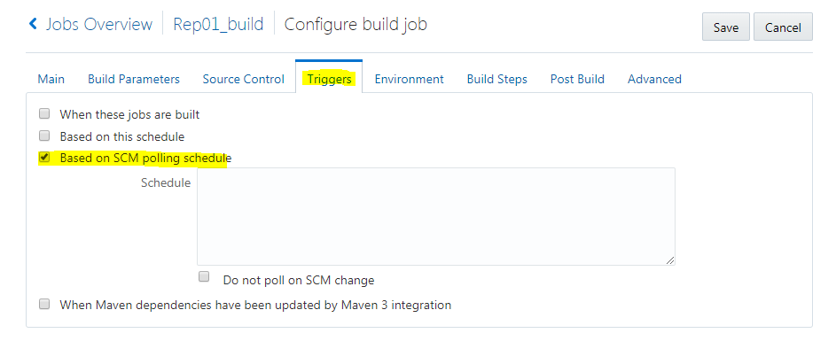


6. **Build Steps**탭을 클릭하고**Add Build Step**를 클릭 한 다음 **Execute shell**을 선택합니다. 


7. Command textarea에 다음을 입력하십시오 :`npm install` 

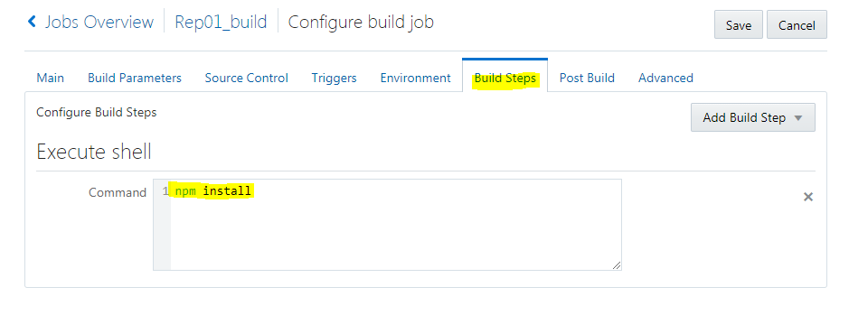


8. **Post Build**탭을 클릭하십시오. **Archive the artifacts**을 ​​선택하십시오. 아카이브 할 파일에`**/target/*`을 입력하고 압축 유형으로 **GZIP**가 선택되어 있는지 확인하십시오. 


9. **Save**을 클릭하여 구성을 완료하십시오. 

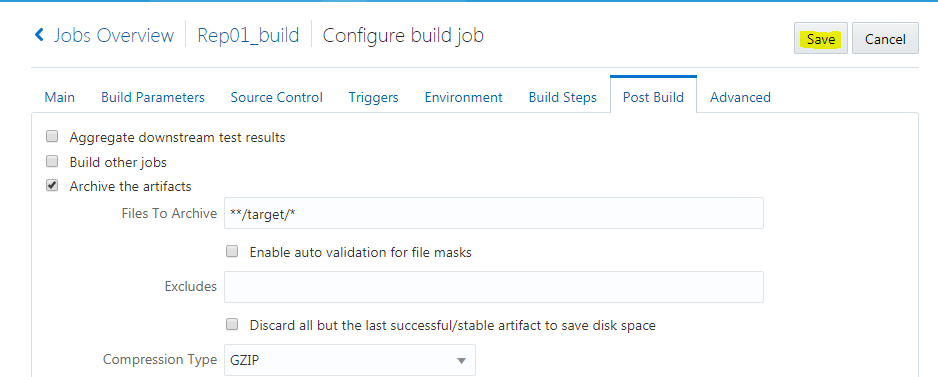


10. 빌드는 1-2 분 내에 자동으로 시작됩니다. 자동으로 시작되지 않으면 **[Build Now]**버튼을 클릭하십시오. 

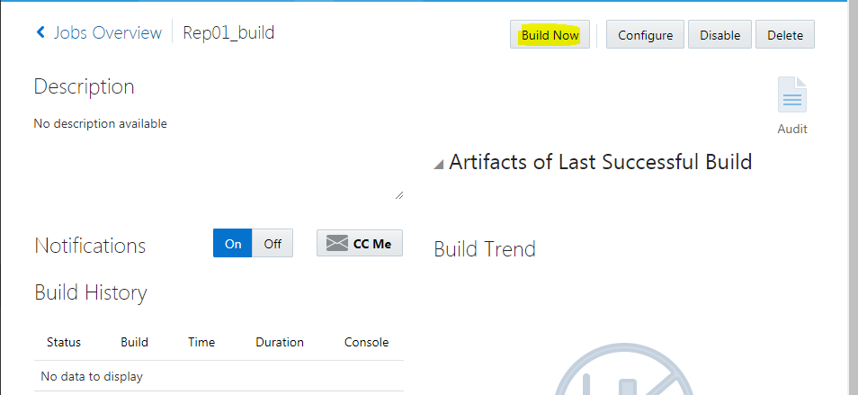


11. 상태는 다음 다이어그램과 유사하게 바뀝니다. 


빌드 작업을 시작하려면 몇 분 정도 기다려야합니다. 


12. 빌드가 완료 될 때까지 몇 분이 소요됩니다. 다음 단계로 진행하기 전에 빌드가 완료 될 때까지 기다리십시오 - **배포 구성을 생성하기 위해 빌드 아티팩트가 필요하므로**. 


### 1.2.2 기본 배포 프로세스 만들기 - REST API 제공


1. **Deploy**를 클릭하여 배포 페이지에 액세스하고 **[+ New Configuration]**버튼을 클릭하십시오. 


2. 다음 데이터를 입력하십시오. 

	- **Configuration Name:** OfferAPIDeploy
	- **Application Name:** offer


```diff
- 복사해서 붙여넣기를 할 때 불필요한 스페이스가 들어갈 수 도 있으니 주의하시기 바랍니다.
```


3. **Deployment Target**의 오른쪽 옆에있는 **[New]**버튼을 클릭하고 **Application Container Cloud ...를 선택하십시오.**

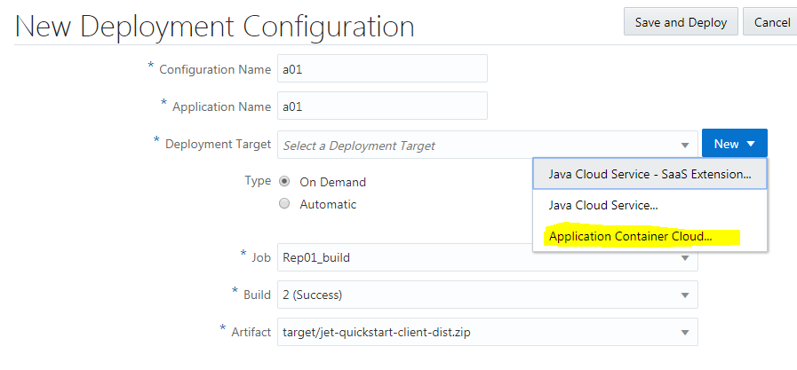


4. 다음 정보를 입력하고 **Test Connection**를 클릭하십시오. 

	- **Data Center:** `your datacenter, e.g. em2, em3, etc`
	- **Identity Domain:** `your identity domain`, e.g. gse00012345, etc
	- **Username:** `username to login to MyService`, e.g. lisa.jones, etc - that is the username you are using.
	- **Password:** `password of the cloud user`, that is the password you are using


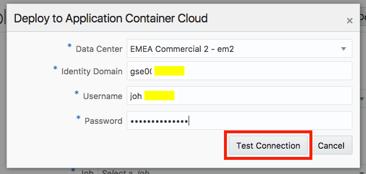


5. 성공하면 **[Use Connection]**버튼을 클릭하십시오. 


6. ACCS 속성에서 다음을 설정합니다. 

	- **Runtime** to `Node`
	- **Subscription** to `Hourly`
	- **Type**에서 `Automatic`으로 설정하고 Deploy stable build only **체크**


**런타임이 Node 인지 다시 한번 확인**


7. **Job**에서 선택하십시오.이 이름은 위의 빌드 작업과 일치해야합니다 (예 :`Offer REST API Build`). 

8. **Artifact**에서 선택하십시오.이 이름은 위의 아카이브 아티펙트와 소스 코드의 package.json과 일치해야합니다 (예 :`target/offer.zip`). 


9. **Include ACCS Deployment**상자를 체크하고 다음 json을 추가하십시오. 

```json
{
	"memory":"1G",
	"instances":"1",
	"services": [
	{
	  "identifier": "DBService",
	  "type": "DBAAS",
	  "name": "apacctddb",
	  "username": "loyalty",
	  "password": "Welcome_1"
	}
	]
}
```

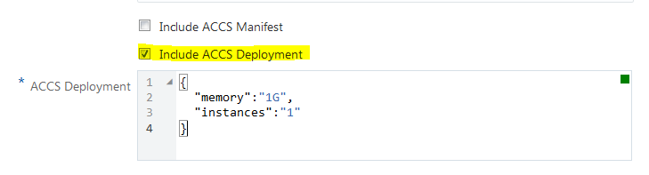

10. 위의 사항을 확인하고 **Save** 버튼을 클릭합니다.

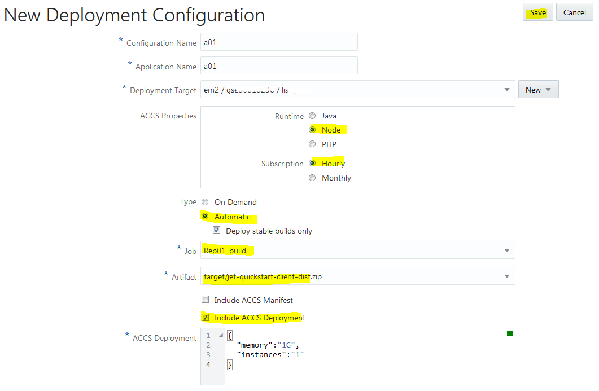

11. 기어 마크가 있는 아이콘을 클릭한 다음 **Start** 를 누릅니다.

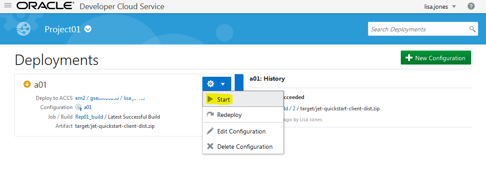

12. 배포하는 작업이 큐에 들어갈 것입니다. 조금 기다리면 **Starting application** 메시지가 **Last deployment succeeded**로 바뀔 것입니다. 만약 배포작업이 실패하면 도움을 요청하십시오.

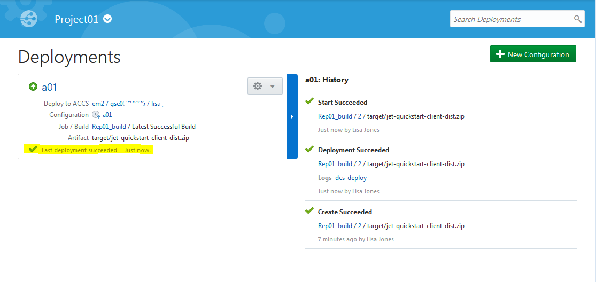

## 1.3 Login to Oracle Application Container Cloud Service

1. 클라우드의 MyService로 다시 돌아가기 위해 **Dashboard** 를 눌러 대쉬보드로 돌아가십시오..


2. Application Container Cloud Service (ACCS) 의 햄버거 버튼을 누르고 **Open Service Console** 를 선택하십시오.

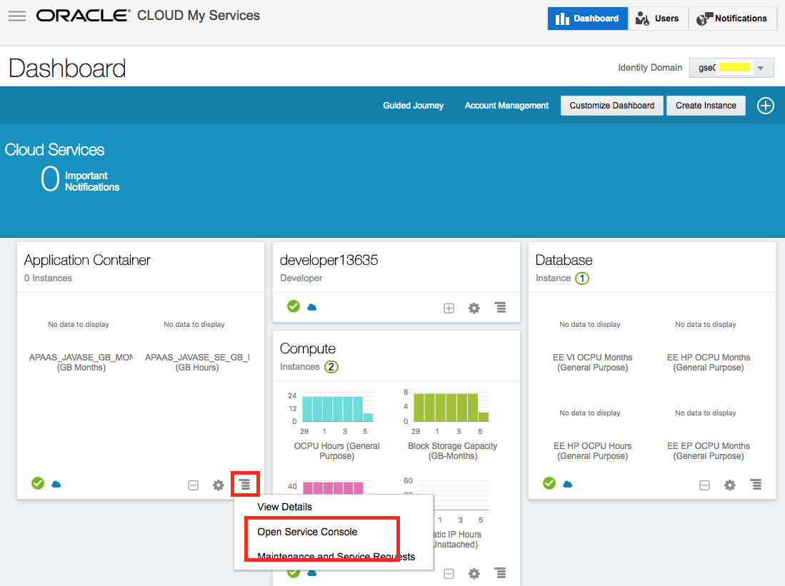

3. ACCS Service Console 이 보여질 것입니다. 그리고 **Offer** 라는 새로운 애플리케이션이 배포된 것을 볼 수 있습니다.

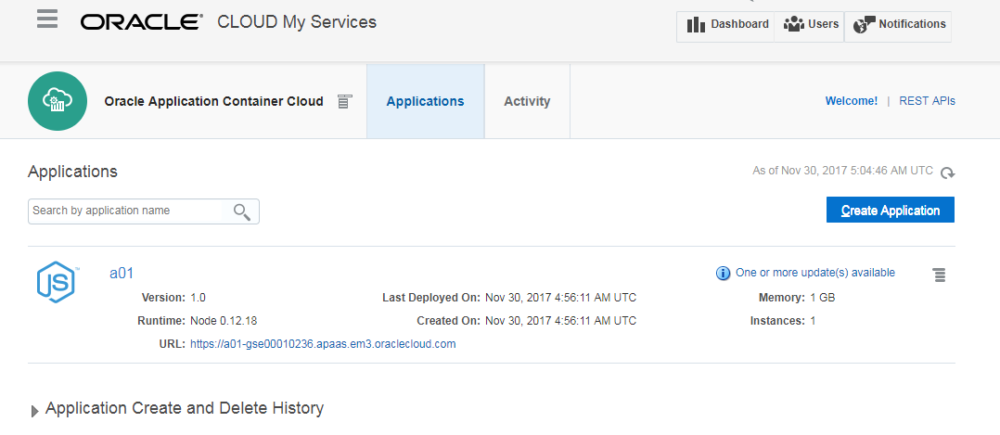

## 1.4 CHECK ACCS Service Binding to DBCS

1. **[ Offer ]** 를 눌러 세부사항을 보십시오.

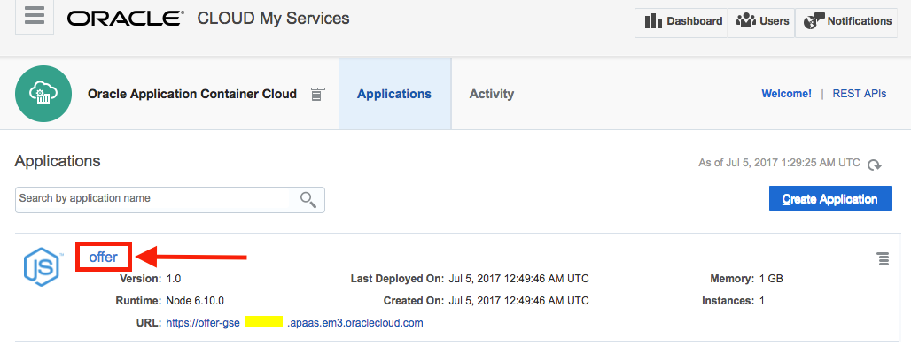

2. 두번째 탭, **Deployments**

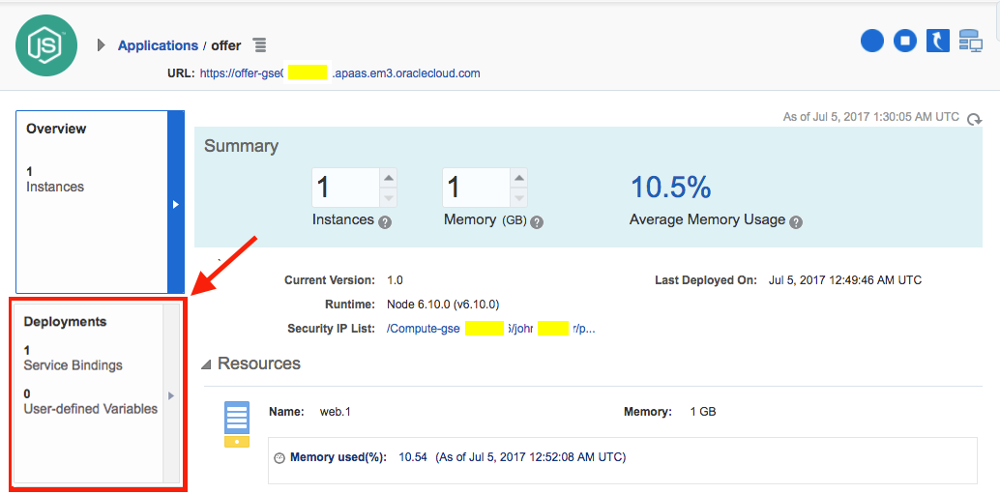

3. **Service Bindings** 섹션에서, 데이터베이스에 바인딩 된 것을 볼 수 있습니다.. **여기선 아무것도 하지 않아도 됩니다.**

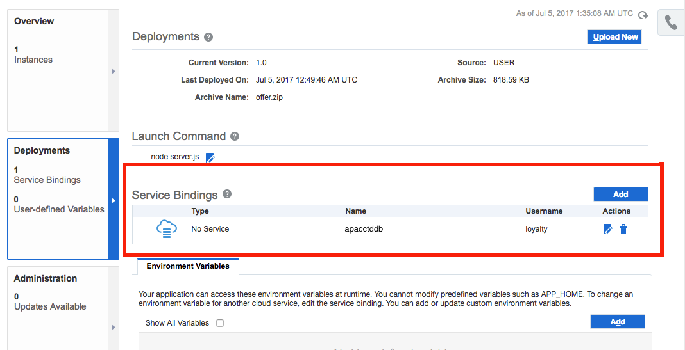


## 1.5 Verify the Working Service

1. 애플리케이션 패널에서 애플리케이션에 대한 URL을 볼 수 있습니다. 예를들면 https://offer-{your-identity-domain}.apaas.{your-data-center}.oraclecloud.com

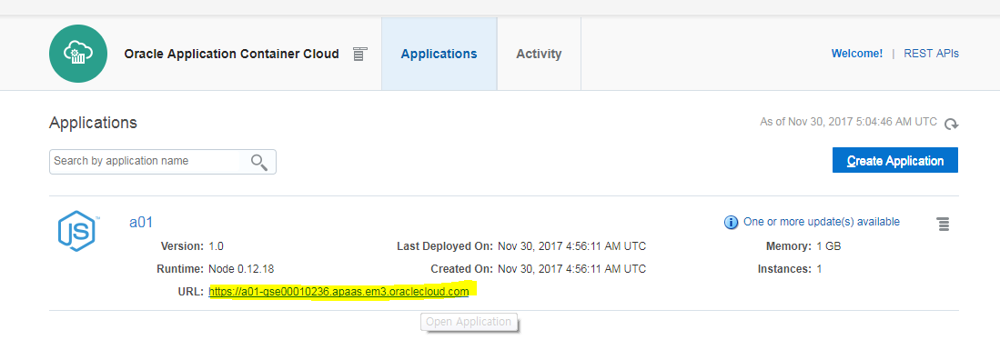

2. 브라우저에서 새로운 탭을 연 다음 위의 주소를 복사하고 붙여넣기 identiy-domain을 부여받은 것으로 채웁니다.

   **offer id** 를 사용하여 QR코드를 성해야 합니다.

  최종 URL을 다음과 같이 되어야 합니다.

https://offer-{your-identity-domain}.apaas.{your-data-center}.oraclecloud.com/ptmgt/v1/offers/10001

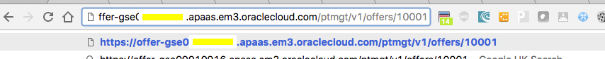

```diff
+ 이 부분을 카피하여 자신의 URL로 채워넣으면 됩니다.
+   https://offer-{your-identity-domain}.apaas.{your-data-center}.oraclecloud.com/ptmgt/v1/offers/
+   https://offer-{your-identity-domain}.apaas.{your-data-center}.oraclecloud.com/
+ 노트패드에 기록하십시오.
+ 나중에 사용 될 것입니다., e.g. Lab 401.
```


3. Microservice에서 제공하는 세부 정보를 얻을 수 있어야합니다. 

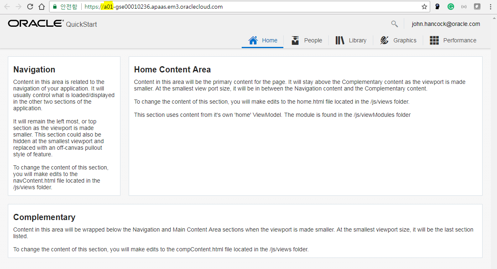


4. 축하합니다. 첫번째 마이크로 서비스가 완성되었습니다. 지금까지 하신 Part 1과 매우 유사한 QR 코드 마이크로 서비스 Lab으로 이동합시다. 

# 2. QR 코드 생성기 마이크로 서비스 생성


## 2.1 초기 Git 저장소 생성 - QR 코드 생성기


1. 아직 수행하지 않았다면 개발자 클라우드 서비스에 로그인하십시오. 
2. 왼쪽 탐색 패널에서 **Project**를 클릭하십시오. 

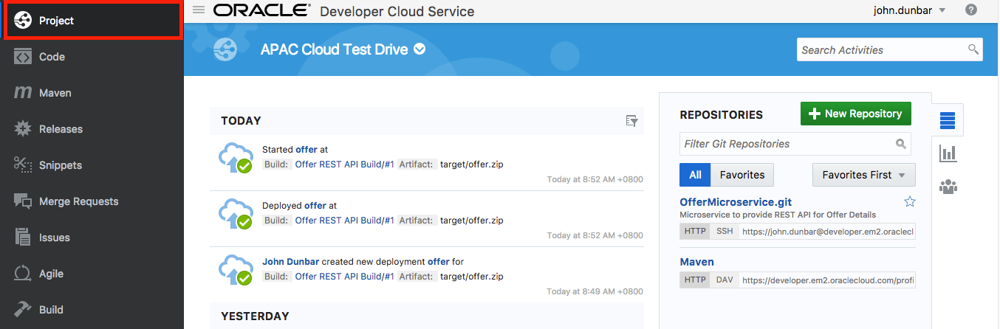


3. **REPOSITORIES**섹션의 오른쪽에서 **New Repository** 를 클릭하여 새로운 Git 저장소를 만듭니다. 


4. 새 저장소 마법사에서 다음 정보를 입력하고 **Create**을 클릭합니다. 

- **이름 :** `QRCodeMicroservice` 
- **설명 :** `제안 QR 코드를 생성하는 마이크로 서비스. QR 코드에는 실제 제공되는 URL이 포함됩니다 .` 
- **초기 내용 :** `기존 저장소 가져 오기` 
- **URL을 입력하십시오 :** `https://github.com/APACTestDrive/QRCodeMicroservice.git` 

```diff
-복사시에 공백을 넣지 않도록 주의하세요.
```


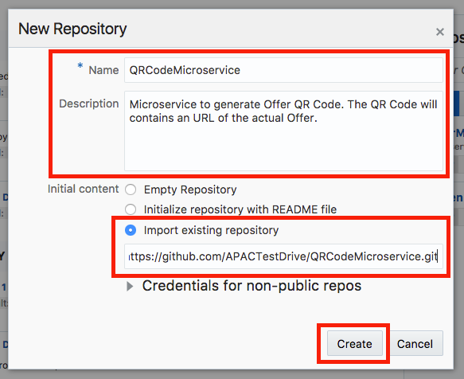


5. 기존 저장소를 기반으로하는 개발자 클라우드 서비스 내에 저장된 새로운 Git 저장소를 만들었습니다 


## 2.2 자신의 환경을 반영하도록 샘플 프로그램 코드 수정


### 2.2.1 Bracket Text Editor에 프로젝트 복제


본 Lab에서는 귀하가 공공 인터넷에 직접 연결되어 있다고 가정합니다 (예 : 프록시 사용 불가**). 

1. Brackets 텍스트 편집기를 시작하려면 **Brackets**바탕 화면 아이콘, [시작] 메뉴 단추 또는 해당 컴퓨터의 바로 가기를 두 번 클릭하십시오. 


2. **File** 풀다운 메뉴에서 **Open Folder**를 선택하십시오. 

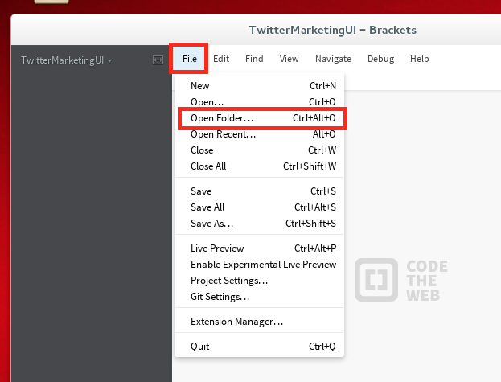


3. 로컬 하드 디스크에 소스 코드를 저장할 폴더를 선택하십시오. 예를 들어 왼쪽에 **d:\oracle**을 입력하고 오른쪽 상단에 **[Create Folder]**를 클릭하십시오. - `선택한 폴더 아래에 새 폴더가 생성되게 됩니다.`


4. 폴더 이름으로 **QRCodeMicroservice**를 입력하십시오. 그런 다음 이름 옆의 공백 (예 : 크기 열)을 클릭하십시오. 

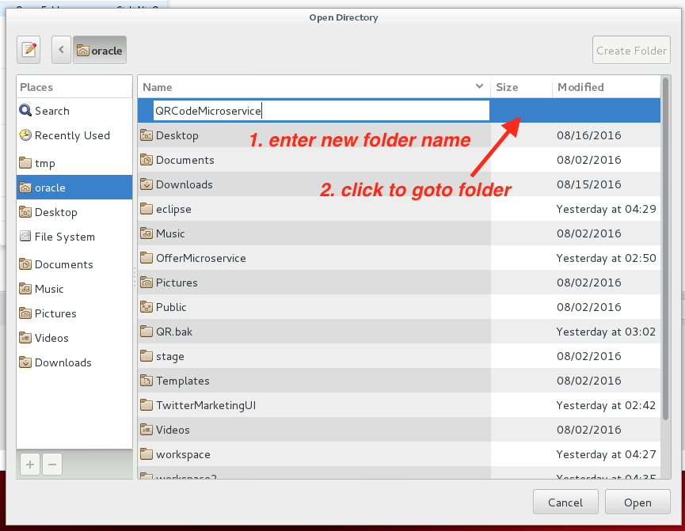


5. **[ Open ]** 버튼을 클릭하여 새로 생성 된 프로젝트 폴더를 엽니 다. 

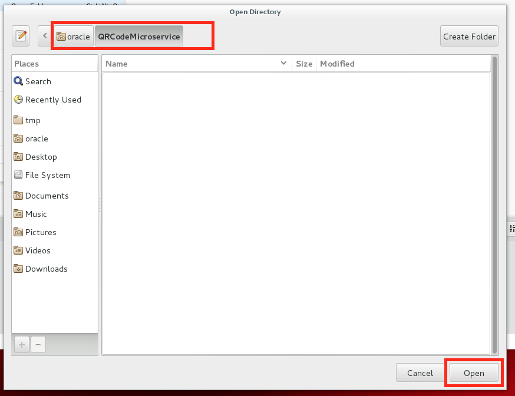


6. **QRCodeMicroservice Git Repository**에서 **Developer Cloud Service**로 돌아가세요.**HTTP**를 클릭하여 Git HTTP URL을 표시한 후 **Copy** 버튼을 클릭하여 URL을 복사하십시오. 


7. 브라켓 편집기로 돌아가서 편집기의 오른쪽에 있는 **GIT** 아이콘을 클릭하십시오. 


8. Git 패널에서 **[ Clone ]**을 클릭하십시오. 


9. Developer Cloud Service에서 복사 한 GIT URL을 붙여 넣습니다. 사용자 이름은 자동으로 채워 져야합니다. 비밀번호를 입력하고 **Save credentials to remote url**을 선택하십시오. 

10. **[OK]** 버튼을 클릭하십시오. 

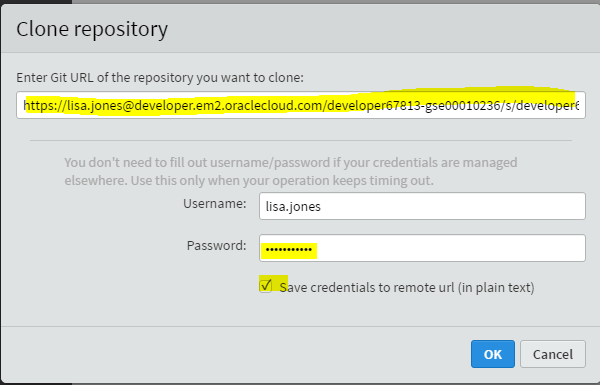


11. 브래킷이 원격 프로젝트를 로컬 폴더에 복제 할 때까지 기다립니다. 


12. 이제 Git 저장소의 로컬 사본이 있습니다. 

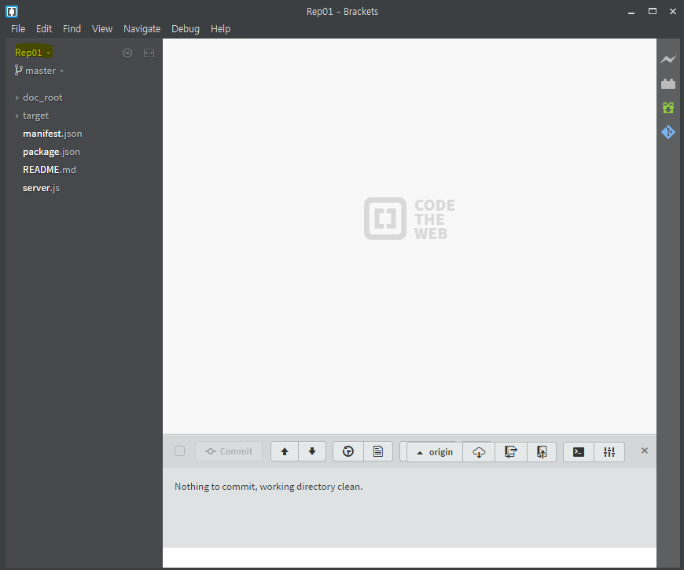


### 2.2.2 환경에 맞게 소스 코드 편집


1. Brackets로 server.js 파일을 엽니다 (더블 클릭). 

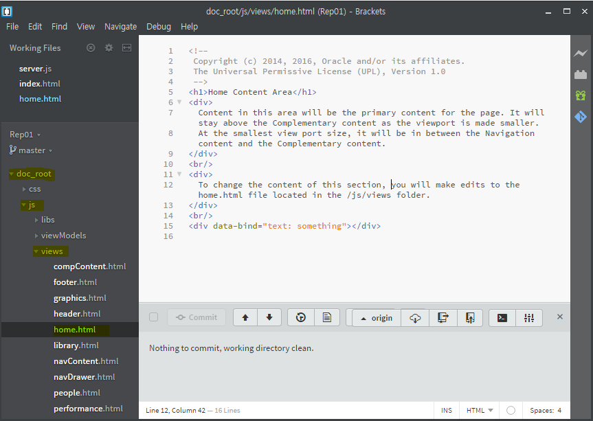


2. 12 행에서 ID 도메인으로 URL을 변경하십시오. 예를 들어, **1.5 절**에서 사용한 내용을 변경하십시오. 보시다시피, **제공되는 REST API 마이크로 서비스**의 URL입니다. 

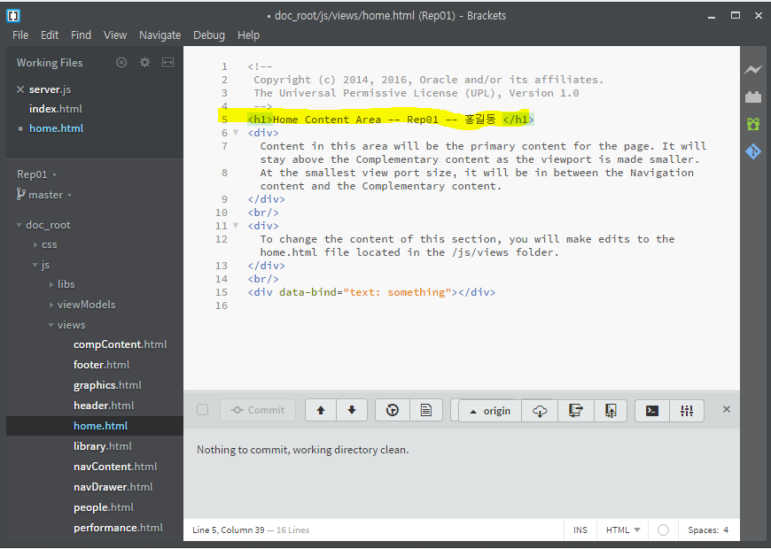


3. 파일을 저장하십시오. (**Ctrl-S**또는 풀다운 메뉴 **File > Save**중에서 선택하십시오.) 

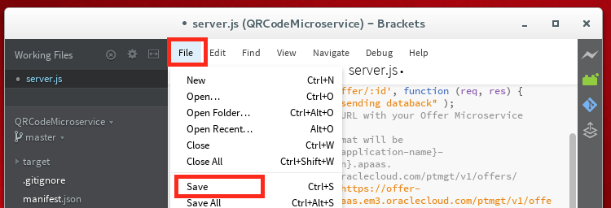


### 2.2.3 새 분기 만들기 및 커밋


1. 왼쪽 탐색 패널에서 **master**를 선택하고 **Create new branch...**를 클릭하십시오.

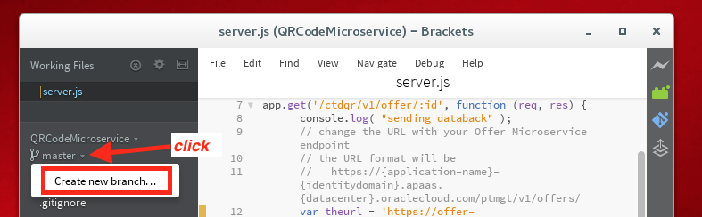


2. 팝업 창에서 분기 이름에 `ChangeURL`을 입력하고 **OK**을 클릭하십시오.

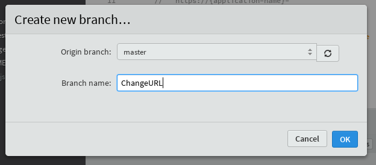


3. **Commit**옆의 확인란을 선택하여 수정 된 모든 파일을 선택하십시오. 이는 아래의 확인란 (server.js)이 자동으로 선택되었음을 의미합니다. 

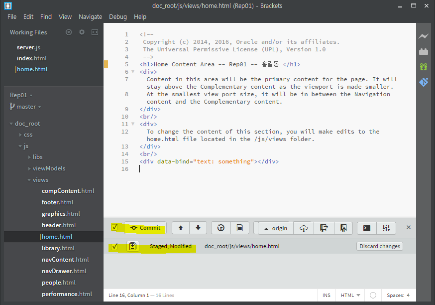


4. **Commit**을 클릭하십시오. 

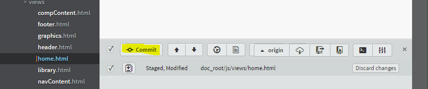


5. 팝업에서 **주석**` 올바른 URL을 사용하도록 소스 코드 수정 `을 입력하고 **확인**을 클릭하십시오. 이것은 귀하의 LOCAL GIT REPOSITORY에 변경 사항을 적용합니다. (코드 검사 문제는 무시할 수 있습니다. 확인하기 전에 코드 변경 사항을 검토 할 수 있습니다) 


6. **Git Push**아이콘을 클릭하십시오. 


7. 팝업 창에서 모든 기본값을 그대로 두고 **Ok**을 클릭하십시오. 


8. Git Push가 완료되면 **Ok**를 클릭하십시오. 


9. 변경 사항을 개발자 클라우드 서비스로 푸시해야 합니다. 원하는 경우 **Developer Cloud Service**로 이동하여 푸시 된 분기를 확인할 수 있습니다.


### 2.2.4 개발자 클라우드 서비스에서 병합 요청을 작성하여 코드 이해하기


1. 개발자 클라우드 서비스에서 **코드**탭을 클릭하십시오. QRCodeMicroservice Repo가 보이지 않으면 QRCode Repo로 변경하십시오. 

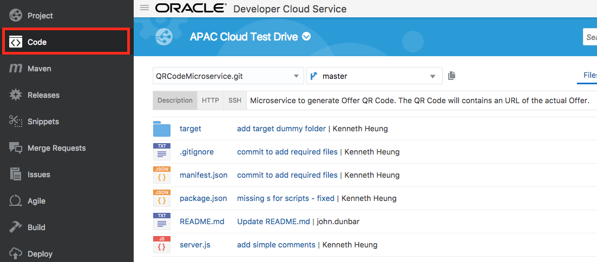


2. ChangeURL 분기를 선택하십시오. 

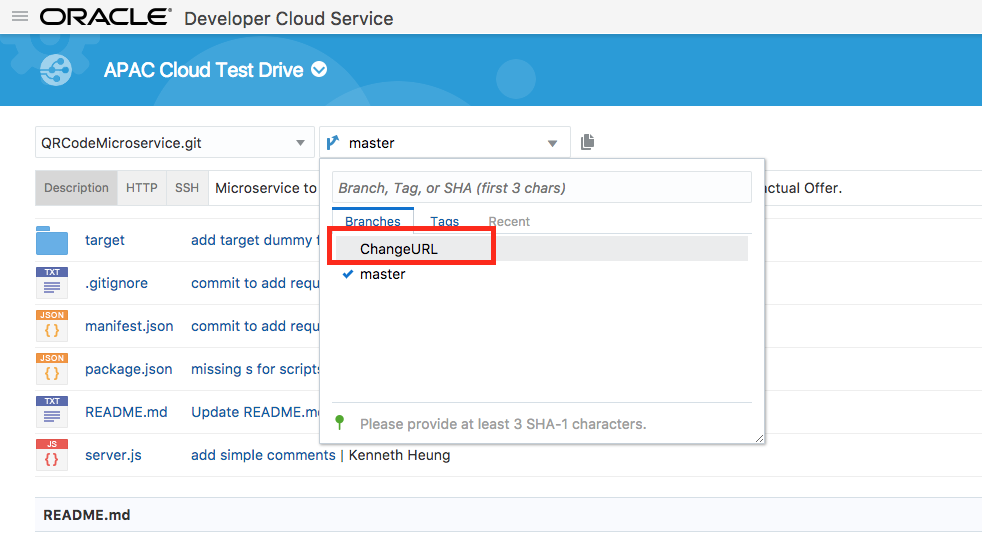


3. 일단 ChangeURL 브랜치에 있습니다. Brackets로 분기하기 위해 만든 최근 커밋을 볼 수 있어야합니다. 

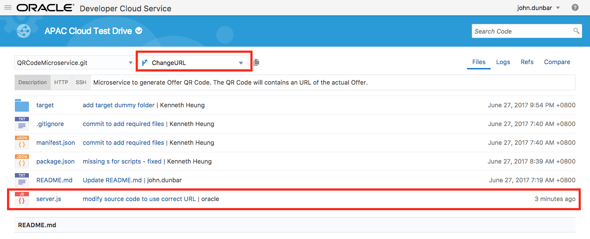


4. 이제 병합 요청을 작성하여 코드를 병합하십시오 - **Merge Requests**을 클릭하여 병합 요청 패널로 이동하십시오. 

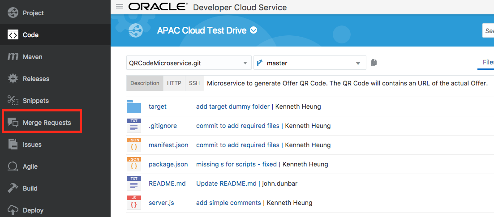


5. **New Merge Request**버튼을 클릭하십시오. 

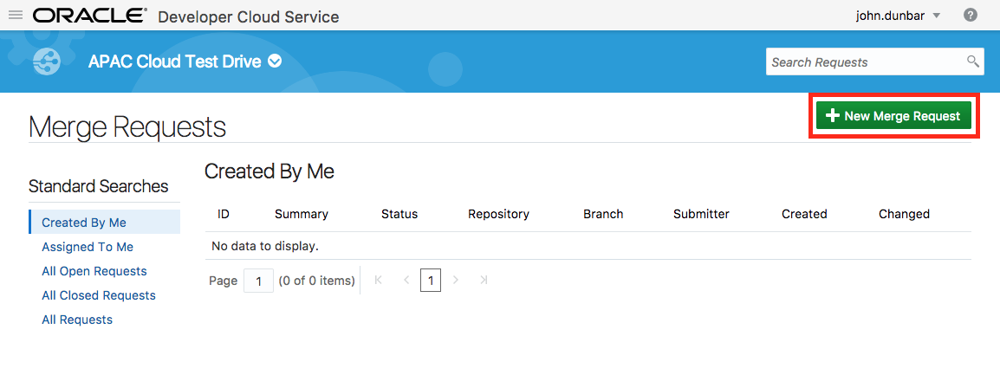


6. 새 병합 요청에 다음 정보를 입력하고 **Next**을 클릭하십시오.

  - **Repository:** `QRCodeMicroservice.git`
  - **Target Branch:** `master`
  -	**Review Branch:** `ChangeURL`

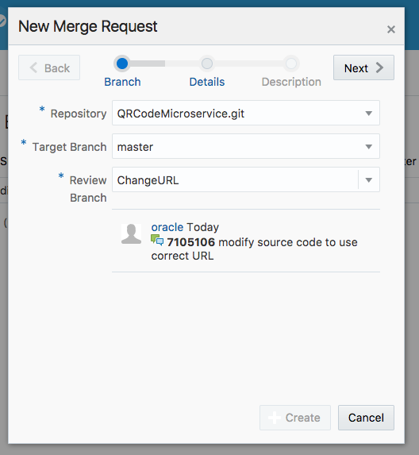


7. **Detail**에 다음 정보를 입력하고 **Next**을 클릭하십시오.

  - **Summary:** `branch ChangeURL에 대한 Merge 요청`
  - **Reviewers:** `작업하고 있는 사용자를 선택` (예: Cloud Admin, John Dunbar, etc)

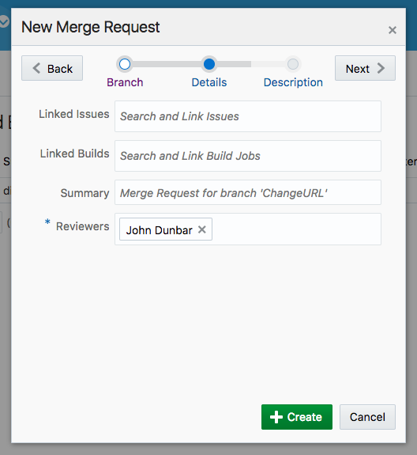


8. 요청을 검토하고**[+ Create]**버튼을 클릭하십시오. 

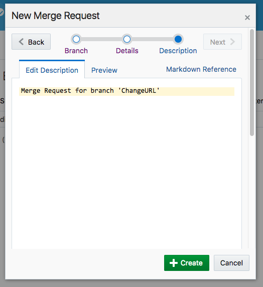


9. 이제 병합 요청이 생성되었습니다. 우리는 다음 섹션에서 요청을 승인 할 것입니다. 

### 2.2.5 Branch 합병


1. **Merge Request**을 클릭하십시오. 방금 생성 한 요청을 선택하면 요청을 검토 할 수 있습니다. 

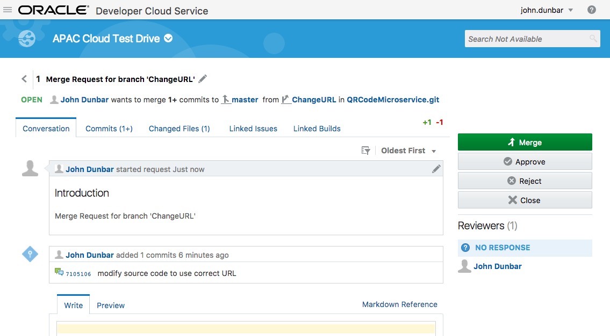


2. 요청이 로드되면 **Change Files** 탭을 선택하십시오. 변경 사항을 검토하십시오. 요청을 승인하기 전에 의견을 추가 할 수 있습니다. 

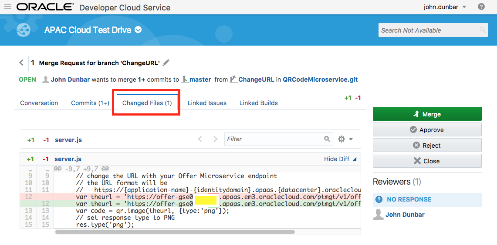


3. 원하는 경우 **[Approve]** 버튼을 클릭하여 의견을 추가 할 수 있습니다 

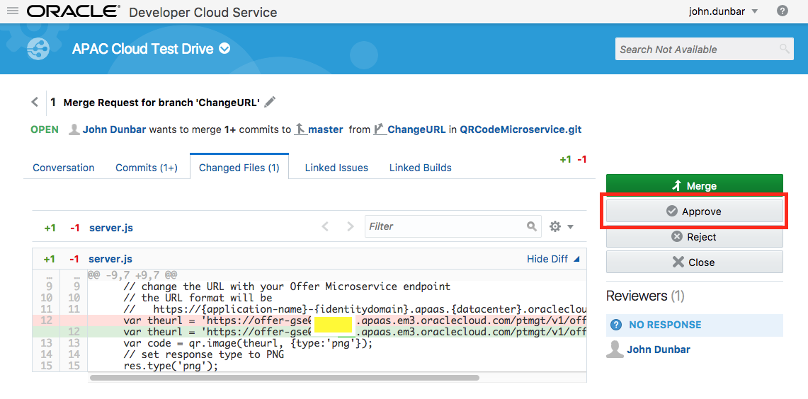


4. `승인 됨` 과 같은 몇 가지 설명을 입력하고 **OK**을 클릭하십시오. 

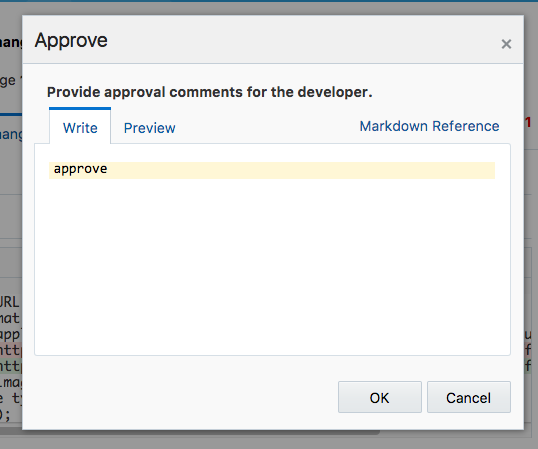


5. 요청이 검토 자에게 승인되었음을 알 수 있습니다. 병합을 진행하려면 **Merge** 버튼을 클릭하십시오. 

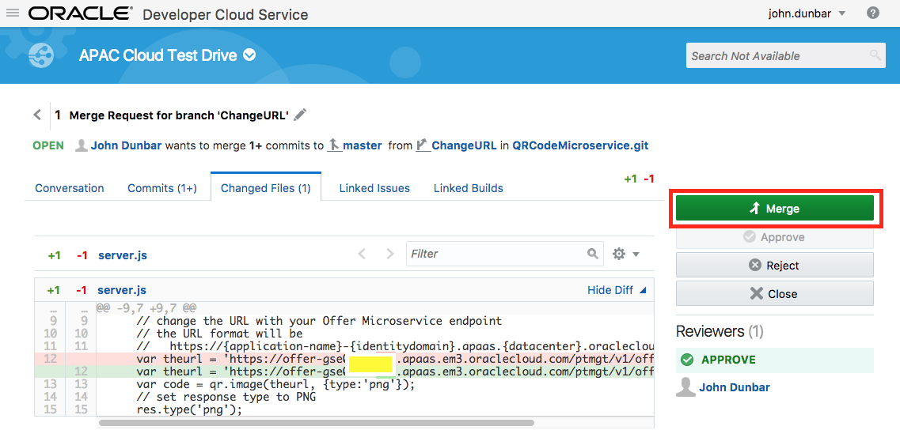


6. 기본값을 그대로 사용하거나 원하는 설명을 입력하십시오. **Delete Branch**를 선택하면 병합 후 ChangeURL Branch가 삭제됩니다. **Merge Commit**버튼을 클릭하십시오. 

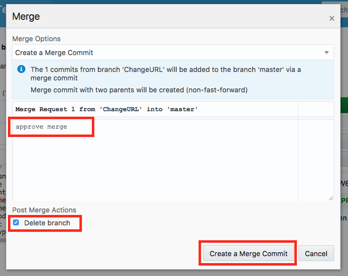


7. 이제 코드 병합이 커밋되어 마이크로 서비스를 만들 수 있습니다. 

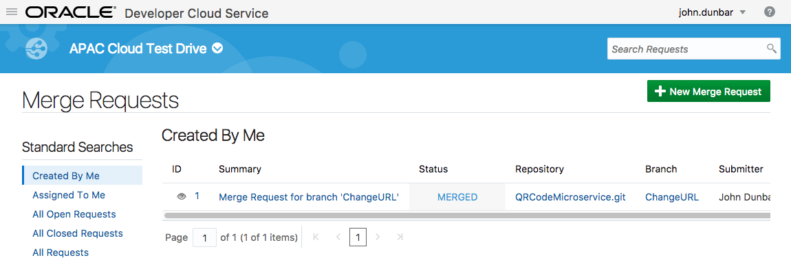


## 2.3 기본 빌드 및 배포 프로세스 만들기 - QR 코드 생성기


개발자 클라우드 서비스에서 관리하는 Git Repository에 소스 코드가 있으므로 마스터 분기를 커밋 할 때마다 트리거되는 빌드 프로세스를 만들어야 합니다. 이 섹션에서는 **쉘 스크립트**빌드 프로세스를 설정합니다. 

### 2.3.1 기본 빌드 프로세스 생성 - QR 코드 생성기


1. 탐색 패널에서 **Build**를 클릭하여 빌드 페이지에 액세스하십시오. 

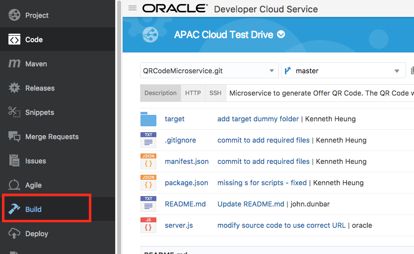


2. **[+ New Job]** 을 클릭하십시오.

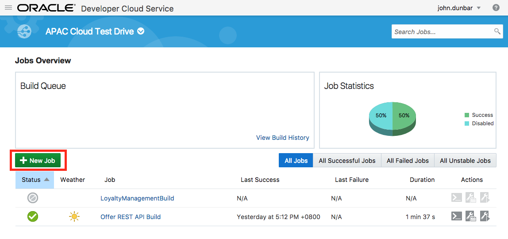


3. New Job 팝업 창에서 작업 이름에 대해 `QR Code Generator Build`를 입력하고 **Save**을 클릭하십시오. 

```diff
-Please BE CAREFUL that you have not added extra white space before or after the information when copy-n-paste
```


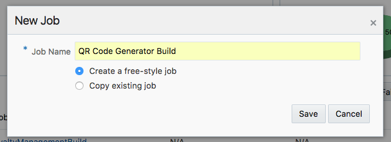


4. 이제 작업 구성 화면에 배치됩니다. 

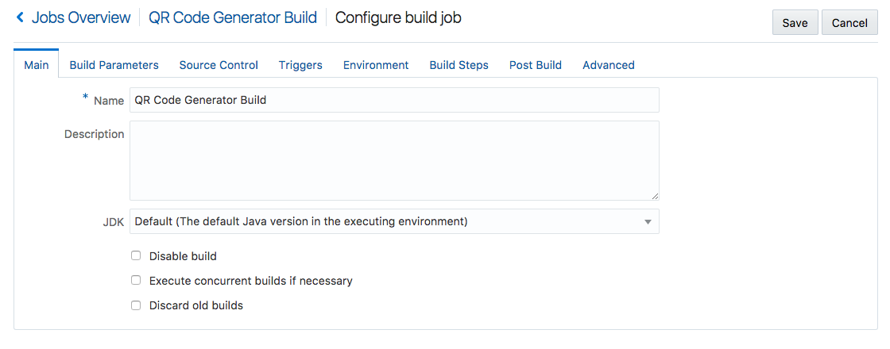


5. **소스 제어**탭을 클릭하십시오. **Git** 라디오 버튼을 선택하십시오. 리포지토리 섹션의 URL 드롭 다운에서 **QRCodeMicroservice.git**를 선택하십시오. 

	**Note:** Make sure you select the Git repository for the QR Code Microservice.


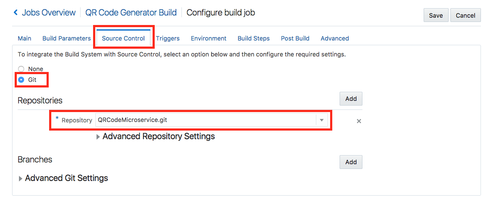


6. **Trigger**탭을 클릭하십시오. **Based on SCM polling schedule** 체크

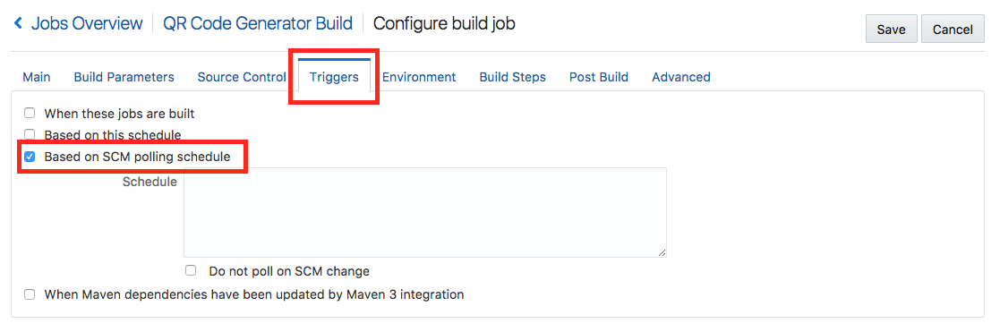


7. **Build Steps** 탭을 클릭,  **Add Build Step** 클릭하고  **Execute shell** 선택.

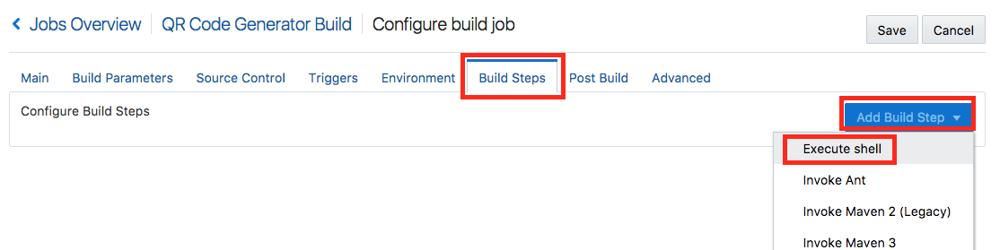


8. Command textarea에 다음을 입력하십시오 :`npm install` 

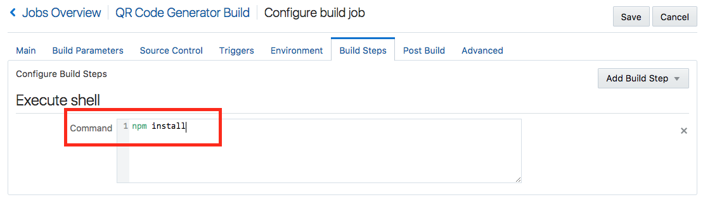


9. **Post Build**탭을 클릭하십시오.**Archive the artifacts**을 ​​선택하십시오. 아카이브 할 파일에 `**/target/*`을 입력하고 압축 유형으로 **GZIP**가 선택되어 있는지 확인하십시오. 

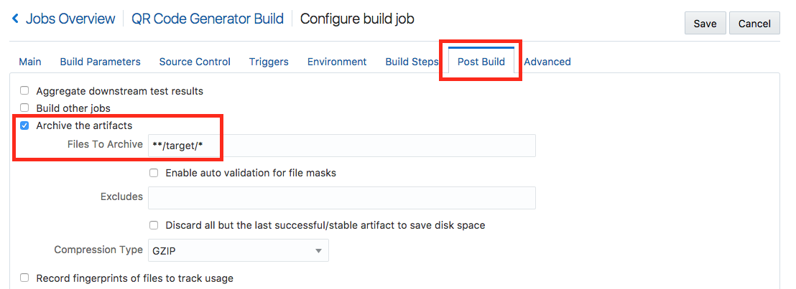


10. **Save**을 클릭하여 구성을 완료하십시오. 

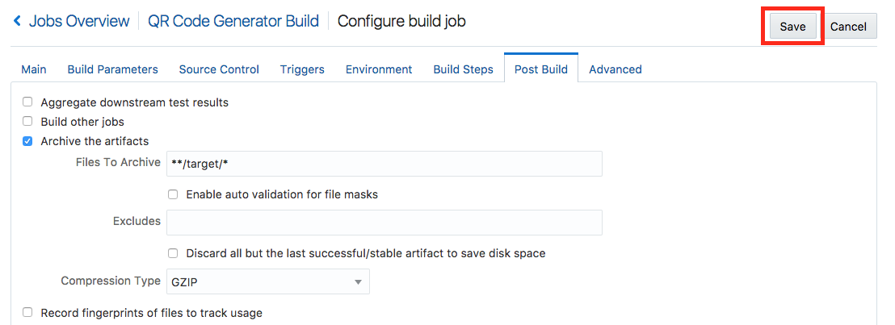


11. 빌드는 1-2 분 내에 자동으로 시작됩니다. 자동으로 시작되지 않으면 **[Build Now]**버튼을 클릭하십시오. 

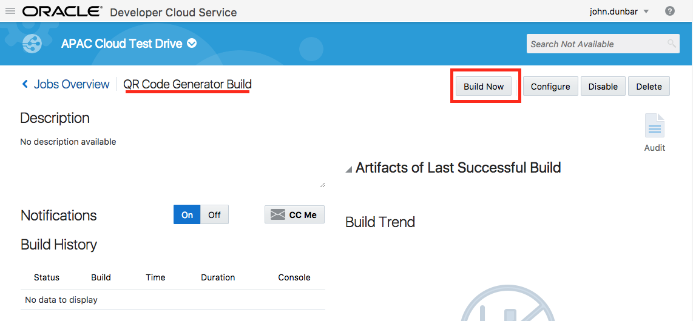


12. 상태가 다음 다이어그램과 비슷하게 바뀝니다. 

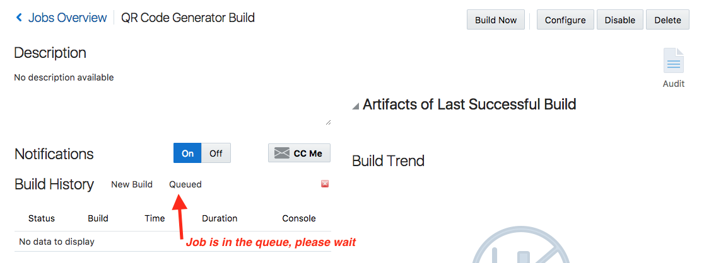


구축 단계 : 잠시 기다려주십시오. - 작업 변경 양식이 실행 대기열로 들어가기까지 몇 분이 걸릴 수 있습니다. 

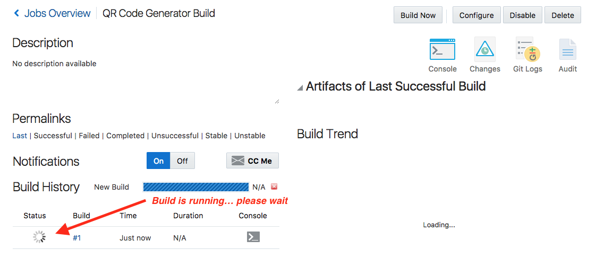


13. 빌드를 완료하려면 serval 분이 소요됩니다. 다음 단계로 진행하기 전에 빌드가 완료 될 때까지 기다리십시오 - **배포 구성을 생성하기 위해 빌드 아티팩트가 필요하므로**. 

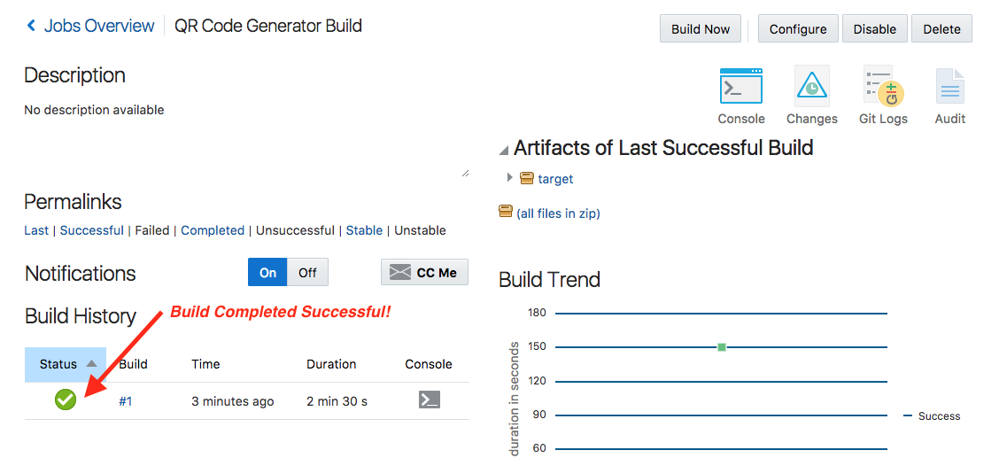


### 2.3.2 기본 배포 프로세스 만들기 - QR 코드 생성기


1. **Deploy**를 클릭하여 배포 페이지에 액세스합니다. 

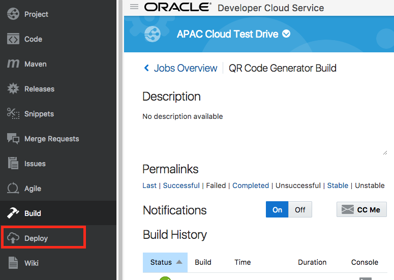


2. **[+ New Configuration]** 버튼을 클릭하십시오. 

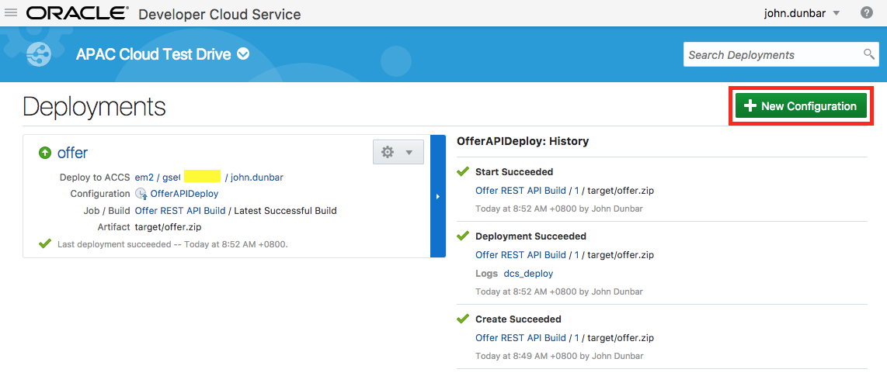


3. 다음 데이터를 입력하십시오. 

  - **Configuration Name:** QRCodeGeneratorDeploy
  - **Application Name:** qrcodegenerator 

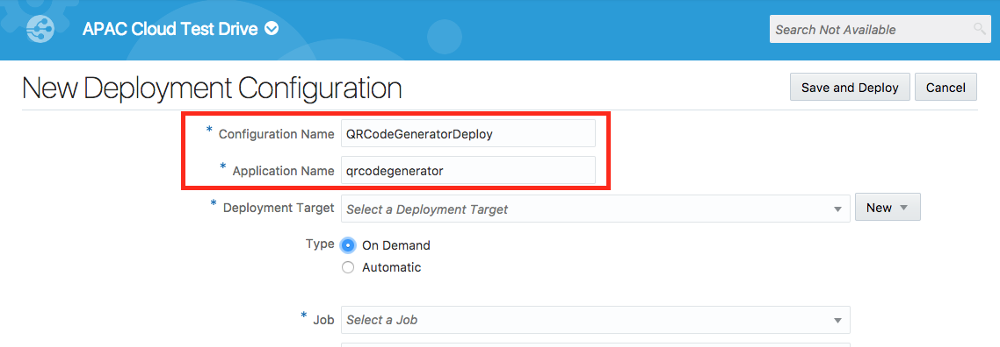


**Offer REST API Microservice에서 배포를 만들었으므로 동일한 대상**을 다시 사용할 수 있습니다. 

**Deployment Target**에서 위에서 만든 **동일한 것**을 선택하십시오. 그것은`Application Container Cloud`와 비슷한 것이어야 합니다. **em2/your-identity-domain/your-user-name**

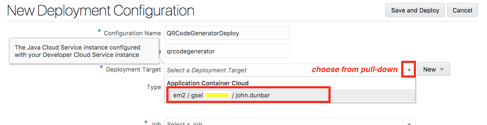


5. **Deploy to Application Container Cloud** 창이 나타나고 정보를 확인하고 **암호를 입력**한 다음 **[Test Connection]** 버튼을 클릭하십시오. 

  - **Data Center:** `your datacenter, e.g. em2, em3, etc`
  - **Identity Domain:** `your identity domain, e.g. gse00012345, etc`
  - **Username:** `username to login to MyService, e.g. cloud.admin, etc`
  - **Password:** `password of the cloud user`

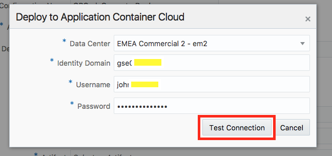


6. 테스트가 성공하면 **Use Connection**을 클릭하십시오. 

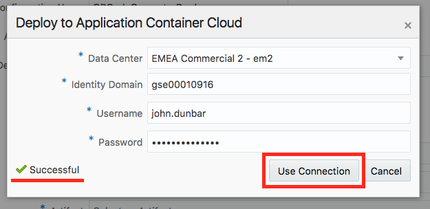


7. ACCS 속성에서 다음을 설정합니다. 

  - **Runtime** to `Node`
  - **Subscription** to `Hourly`
  - **Type**을 `Automatic`으로 설정하고 `Deploy stable build only` **확인**

**런타임으로 노드를 선택하십시오**

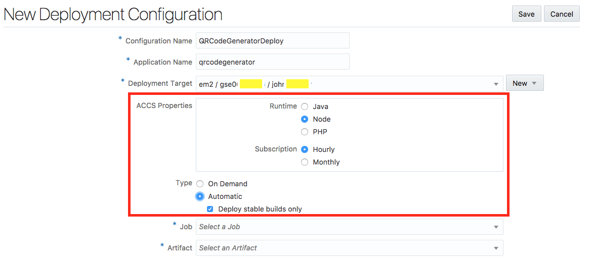


8. **Job**에서 선택하십시오.이 이름은 위의 빌드 작업과 일치해야 합니다 (예 :`QR Code Generator Build`).**Artifact**에서 선택하십시오.이 이름은 위의 아카이브 아티펙트와 소스 코드의 package.json과 일치해야합니다 (예 :`target/qrcodegenerator.zip`). 

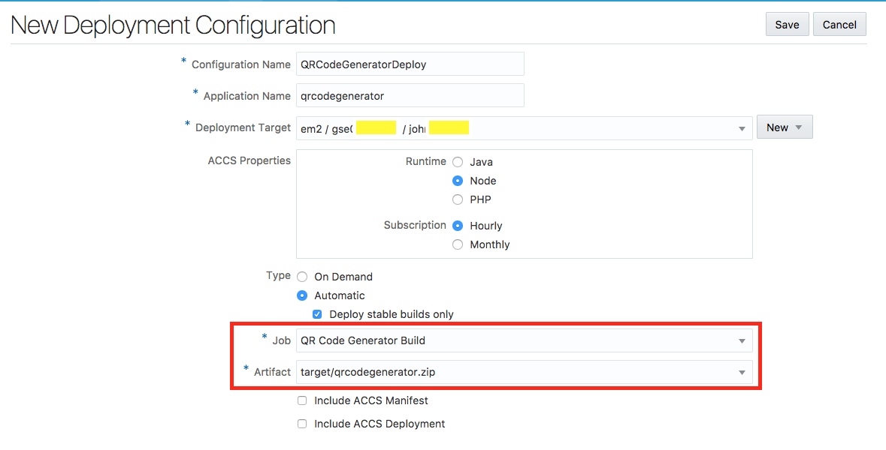


9. `Include ACCS Deployment` 박스를 체크하고 다음 json을 입력하십시오 

```json
{
	"memory":"1G",
	"instances":"1"
}
```

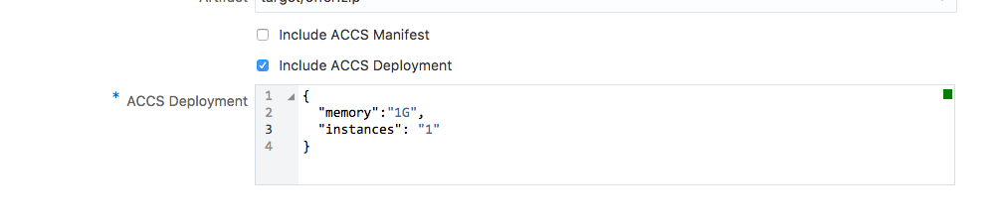

10. 위의 정보를 확인하고  **Save** 버튼을 누릅니다.

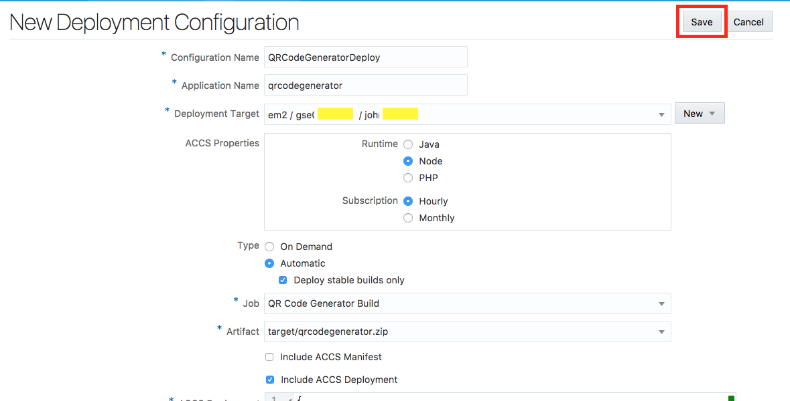

11. 배포 작업에서 기어박스를 누르고 **Start**을 선택합니다.


12. 배포작업은 큐에 들어 갈 것이고 곧 이어  **Starting application** 메시지가  **Last deployment succeeded**로 바뀔 것입니다. 실패하면 질문하십시오.

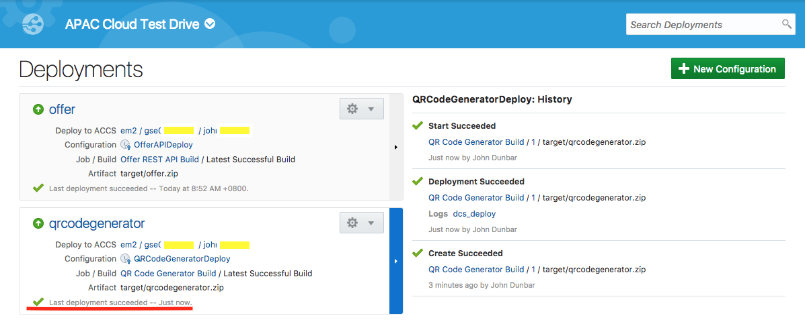

## 2.4 Login to Oracle Application Container Cloud Service

1. Oracle Public Cloud 탭의  **Dashboard**을 눌러서 클라우드 데시보드로 갑니다.

2. Application Container Cloud Service (ACCS) 의 햄버거 버튼을 클릭하고  **Open Service Console** 를 선택합니다.


3. ACCS Service Console에서 방금 생성된 **qrcodegenerator** 를 확인할 수 있습니다.

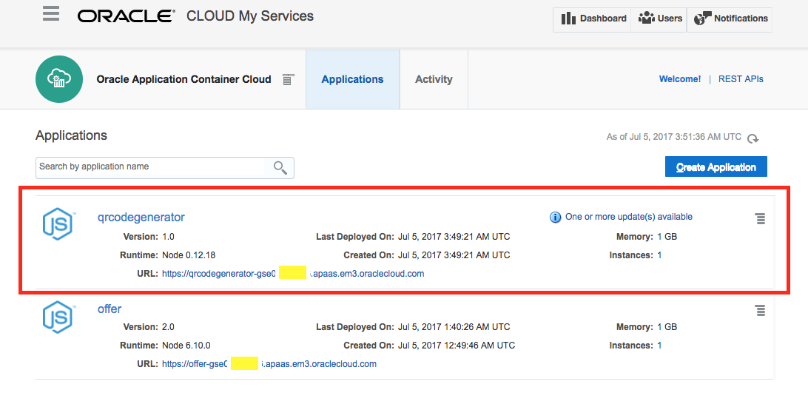

4. 애플리케이션을 접근하기 위하여 브라우저 탭을 열어 URL을 복사하여 붙여 넣습니다.

  REST endpoint와  **offer id** 그 나중에 QR Code를 생성하기 위하여 필요할 겁니다.

  결국은 다음과 같은 URL이 될 것입니다.

	https://qrcodegenerator-{your-identity-domain}.apaas.{your-data-center}.oraclecloud.com/ctdqr/v1/offer/10001

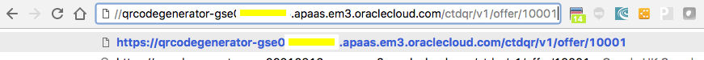		

5. 브라우저에 QR 코드가 보일 것입니다.

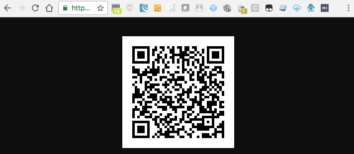

```diff
+ 다음의 URL을 카피하십시오.
+   https://qrcodegenerator-{your-identity-domain}.apaas.{your-data-center}.oraclecloud.com/ctdqr/v1/offer/
+   https://qrcodegenerator-{your-identity-domain}.apaas.{your-data-center}.oraclecloud.com
+ 그리고 노트패드에 붙여 넣어 놓습니다.
+ 나중에 Lab 304 Step 27에서 사용될 것입니다.
```

**OPTIONAL STEP:** 만약 QR Code 리더가 있으면 QR Code를 디코딩 할 수 있습니다.

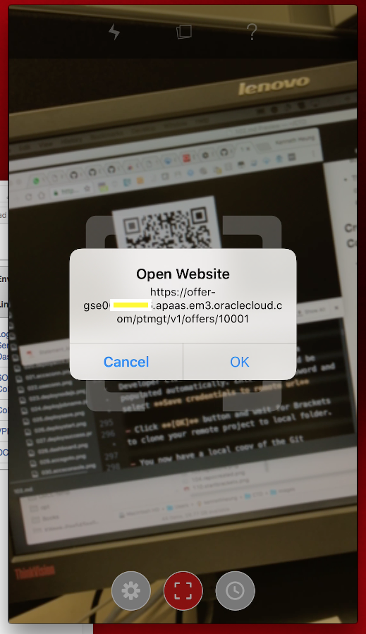


# 축하합니다.! Microservice Lab을 완료했습니다.


[go back to the Cloud Test Drive Main Page](../README.md) 

