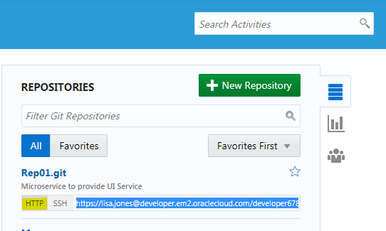
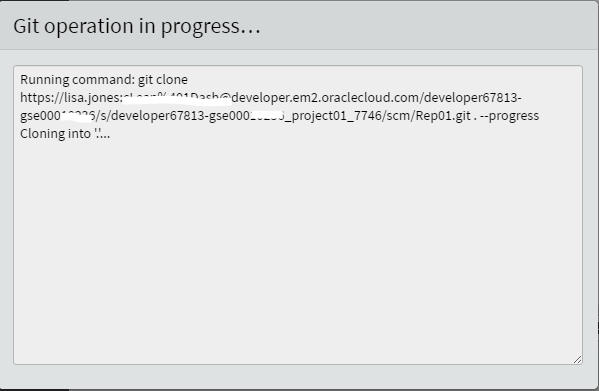
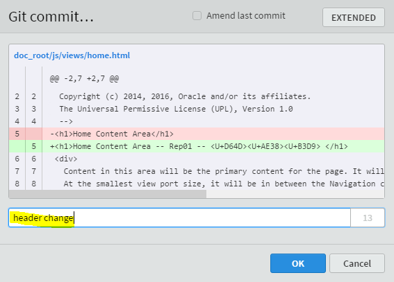
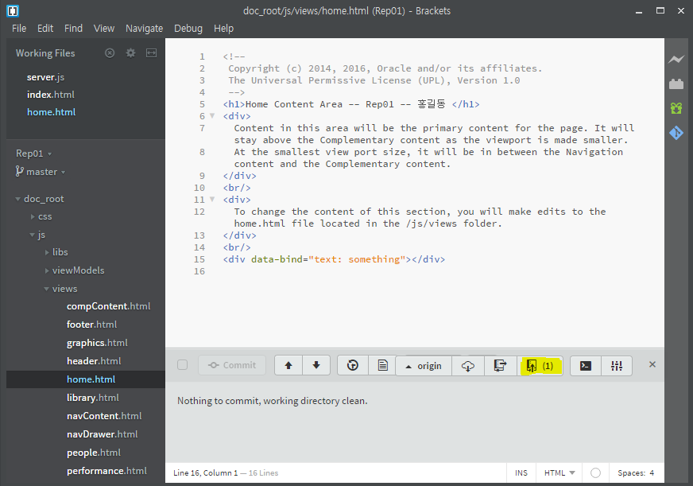
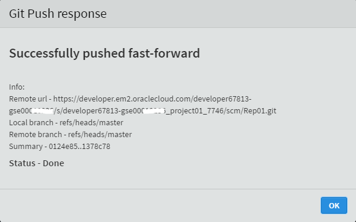
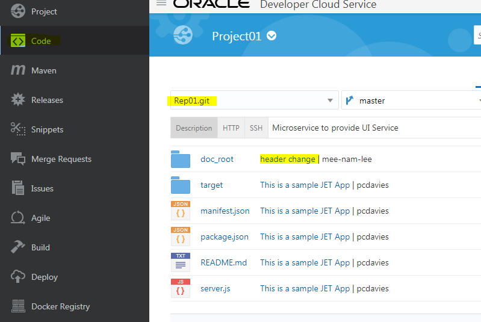

업데이트 : 2017 년 12 월 01 일 

## Lab 02 소개

이 Lab은 **Oracle Developer Cloud**와 Container기반의 **Application Container Cloud Service**를 사용하여 DevOps 자동화 과정의 핵심 부분인 **CI(Continuous Integration) / CD (Continuous Delivery)** 실습을 위한 Lab입니다. 

## 목표

- 로컬 컴퓨터의 개발자툴(IDE)에서 Developer Cloud와 연결하여 코드 가져오기
- 소스 수정하여 commit/push하기
- Developer Cloud Service의 자동 빌드와 자동 배포 기능 활용하기 

## 필수 아티팩트

- 이 실습에서는 귀강사가 제공한 Oracle Public Cloud 계정이 필요합니다. 
- 이 Lab에서는 로컬 호스트 컴퓨터에서 **`Brackets`** 편집기를 사용한다고 가정합니다. 

## 필수 선수 과정
- 만약 자신의 컴퓨터에 Bracket과 Git이 설치 되어 있지 않다면 이 과정에서 두 소프트웨어를 설치 하십시오
- [**GIT 설치**](gitclient.md) 
- [**Bracket 설치**](brackets.md) 

## 특별주의 사항

- 복사하여 붙여 넣을 때 주의하십시오. 복사한 내용의 *이전*이나 *이후*에 **공백**을 넣게 되면 오류가 발생할 수 있습니다. 

# IDE에서 프로그램 코드 수정

### Bracket Text Editor에 프로젝트 복제

본 Lab에서는 귀하가 인터넷에 직접 연결되어 있다고 가정합니다 (예 : 프록시 사용 불가**). 

- Brackets 텍스트 편집기를 시작하려면 **Brackets**바탕 화면 아이콘, [시작] 메뉴 단추 또는 해당 컴퓨터의 바로 가기를 두 번 클릭하십시오. 

- **File** 풀다운 메뉴에서 **Open Folder**를 선택하십시오. 

- 로컬 하드 디스크에 소스 코드를 저장할 폴더를 선택하십시오. 예를 들어 왼쪽에 **d:\oracle**을 입력하고 하부 폴더로 **Rep## , 예: Rep01**을 생성합니다. `해당 폴더 명은 각자 만든 Repository 명과 동일합니다`. - 선택한 폴더 아래에 새 폴더가 생성되게 됩니다.`

- 생성한 폴더를 엽니다.

- **Developer Cloud Service**로 돌아가세요. 화면 우측의 **REPOSITORY** 부분에서 본인이 생성한 Repository를 찾습니다.
- **HTTP**를 클릭하여 Git HTTP URL을 표시한 후 url을 클립보드로 복사합니다.

- 브라켓 편집기로 돌아가서 편집기의 오른쪽에 있는 **GIT** 아이콘을 클릭하십시오. 

- Git 패널에서 **[ Clone ]**을 클릭하십시오. 

- Developer Cloud Service에서 복사 한 GIT URL을 붙여 넣습니다. 사용자 이름은 자동으로 채워 져야합니다. 비밀번호를 입력하고 **Save credentials to remote url**을 선택하십시오. 

- **[OK]** 버튼을 클릭하십시오. 

- 브래킷이 원격 프로젝트를 로컬 폴더에 복제 할 때까지 기다립니다. 

- 이제 Git 저장소의 로컬 사본이 있습니다. 

### 환경에 맞게 소스 코드 편집

- Brackets로 home.html 파일을 엽니다 (더블 클릭). 
- home.html은 `doc_root / js / views` 내에 있습니다.

- 5 행에서 headline 부분을 변경합니다. 

- 파일을 저장하십시오. (**Ctrl-S**또는 풀다운 메뉴 **File > Save**중에서 선택하십시오.) 

### 변경 커밋 및 Push

- 파일이 저장되면 하단 창에 Modified 된 파일이 보입니다. 해당 파일 옆의 **check 박스**를 클릭하고 **Commit 버튼 몇 체크 박스**도 클릭합니다. 

- **Commit**을 클릭하십시오. 

- 팝업에서 **주석**`Header Change`을 입력하고 **OK**을 클릭하십시오. 이것은 귀하의 LOCAL GIT REPOSITORY에 변경 사항을 적용합니다. (`코드 검사 문제는 무시할 수 있습니다.` 확인하기 전에 코드 변경 사항을 검토 할 수 있습니다) 

- **Git Push**아이콘을 클릭하십시오. 

- 팝업 창에서 모든 기본값을 그대로 두고 **Ok**을 클릭하십시오. 

- Git Push가 완료되면 **Ok**를 클릭하십시오. 

- 변경 사항을 개발자 클라우드 서비스로 푸시해야 합니다. 원하는 경우 **Developer Cloud Service**로 이동하여 푸시 된 코드를 확인할 수 있습니다.

- 좌측 사이드 메뉴의 **Code**를 선택하면 Repository 화면으로 이동합니다.
- 만약 현재 Repository가 자신의 Repository가 아니라면 **Repository 선택 List 박스**에서 자신의 Repository를 선택합니다.

- Brackets에서 Push 할때 입력한 주석 **header change**가 보일 것입니다. 이것을 클릭하면 변경된 소스로 바로 이동합니다.

- 변경된 소스가 다음과 같이 보이면 정상입니다.

- 이전 Lab에서 신규 code가 push되면 자동으로 빌드가 되게 **Triger**를 설정해 두었기 때문에 **Build**에 가면 빌드가 진행중이거나 이미 완료 되었을 것입니다.

- 좌측 메뉴의 **Build**를 선택하여 Build 화면으로 이동합니다.
- 자신의 빌드명 (에 : **Rep01_build** )를 클릭합니다.

- 새로운 빌드가 진행중이거나 완료되었을 것입니다. 현재 진행중이라면 완료될 때까지 기다리면 됩니다. **Status** 아이콘이 **Green**이면 완료입니다.

- 빌드가 완료되었으면 **Deploy** 메뉴로 이동합니다. 빌드가 정상적으로 완료되면 **자동으로 배포**가 되도록 이전 Lab에서 구성해 두었기 때문에 여기서는 아무런 작업이 필요 없습니다.
- 새롭게 빌드된 산출물로 배포가 이미 완료되었거나 진행중일 수 있습니다. 아직 완료가 되지 않았다면 잠시 기다리면 됩니다. 

- 코드 변경사항이 잘 반영되었는지 서비스 url로 가서 확인 합니다.

- 이전 Lab에서 서비스 url을 기록하고 있었다면 웹 브라우저에서 바로 해당 url로 들어가면 됩니다.

- 만약 이 부분을 잘 모르겠다면 이전 Lab의 `Login to Oracle Application Container Cloud Service` 부분을 살펴보면 됩니다.

- ACCS 서비스 url의 패턴은 다음과 같습니다.
- https://a##-{your-identity-domain}.apaas.{your-data-center}.oraclecloud.com

- Home Content Area 부분에 변경 내용이 잘 나온다면 모든 과정이 완료된 것입니다.

## 축하합니다. CI/CI 과정 자동화 과정을 마쳤습니다. 

[이전 Lab으로 이동합니다.](01_DevOpsLab.md)

[첫 화면으로 이동합니다.](README.md) 

