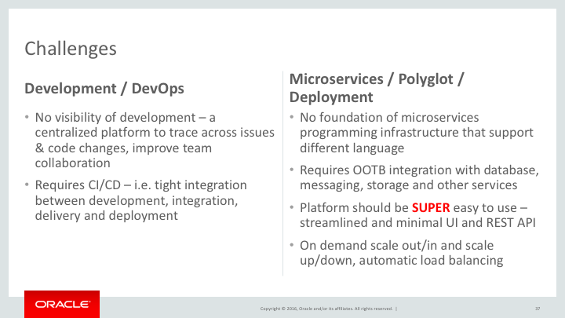
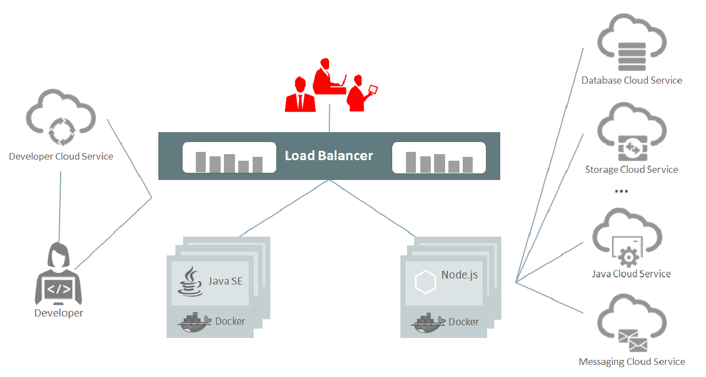
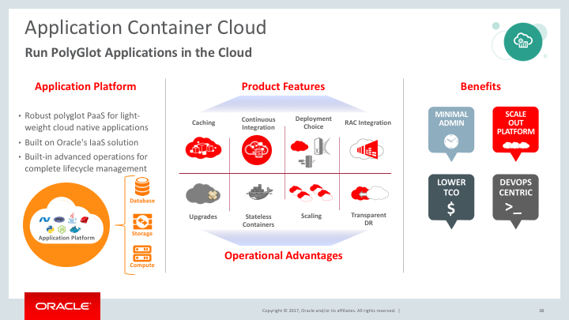
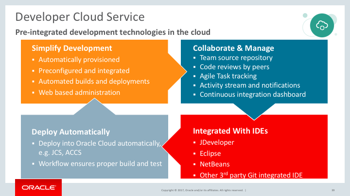
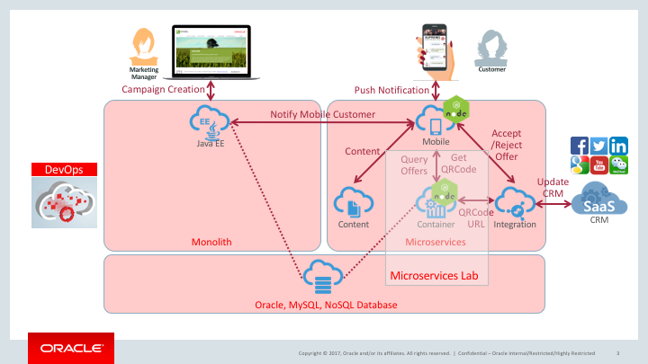

# Oracle APAC Cloud Test Drive

Last Update: July 10, 2017

## Microservice Lab

This lab shows you how to prepare an environment for Microserivces and develop Mircoserivces using Oracle Application Container Cloud Service.

### Introduction

While there is no standard for microservices architectures, the industry mostly agrees on a couple of design points and characteristics that a microservices architecture should follow which are mentioned below

- several, small, minimalistic, independent services
- failure expected
- designed for scale out
- decoupled functionality invoked via messaging
- stateless by nature
- fully automated deployment with DevOps/NoOps

There are some common use cases to adopt microservice, such as

- extend existing monolithic application by adding microservices on the periphery
- decompose an existing modular app into microservices-style
- build net new microservices-style app from ground up

Thus, example requirements for microservice will be,

- scalable, elastic, polyglot
- automated DevOps
- instrument for Application Performance Monitoring and diagnostic
- containers for simplicity & extensibility
- API first for service consumption
- mobile first / modern web UX  

**Microservice allows companies to develop, deploy and update parts of their application in a faster, more agile way, and thereby react to new market requirements and competition in a more timely and flexible manner.**

Microservice architecture (**MSA**) ensures the agile development and deployment of the service. However, there will be different challenges when organization adopting MSA. The following diagram lists a few of such challenges / requirements.

## Oracle Application Container Cloud Service

[Oracle Application Container Cloud Service](https://cloud.oracle.com/en_US/application-container-cloud) is one of the cloud services in the Oracle AppDev Portfolio which lets you deploy Java SE, Node.js, PHP, Python, and/or Ruby applications to the Oracle Cloud.   

Oracle Application Container Cloud Service has these key features:

- A pre-configured environment for Java SE, Node.js, PHP, Python, and Ruby applications.
- Java SE advanced features such as Java Flight Recorder, Java Mission Control, advanced memory management, and ongoing and timely security updates.
- Open platform that supports all Java frameworks and containers such as Spring, Play, Tomcat, and Jersey.
- Support for Java Virtual Machine (JVM) based languages such as JRuby. You can run any language that uses the Java Virtual Machine on this service.
- Enterprise-grade support from Oracle.
- Web-based user interface and REST API.

In addition, you can choose to integrate with other Oracle Cloud services. You can develop your application on your local system, or you can use Oracle Developer Cloud Service.

## Oracle Developer Cloud Service

[Oracle Developer Cloud Service](https://cloud.oracle.com/en_US/application-container-cloud) is a cloud-based development platform that enables agile development methodology and DevOps automation. This hosted team development and delivery platform includes issue tracking, code versioning, wiki, agile-development tools, continuous integration and devliver automation.

## About the Exercise Today

We will use Developer Cloud Service to create and deploy 2 microservices in Application Container Cloud in the coming 1 hour :smile:.
- Leverage existing 3rd party Git Repository
- Create build and deploy jobs in Developer Cloud Service
- Use IDE with Developer Cloud Service
- Leverage Database Cloud Service in your applications
- Deploy on Application Container Cloud Service

   

## [Start The Lab](MicroservicesLab.md)
