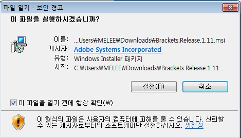
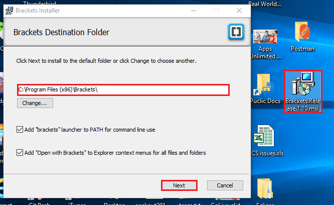
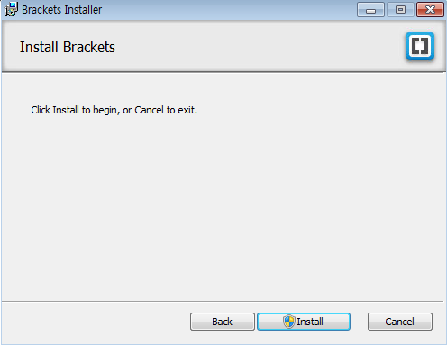
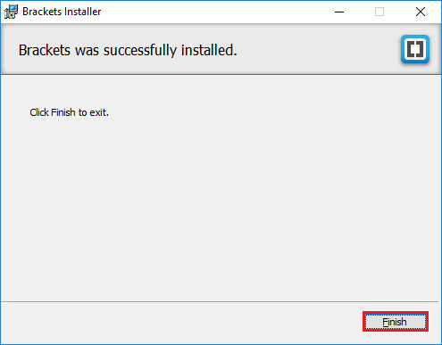
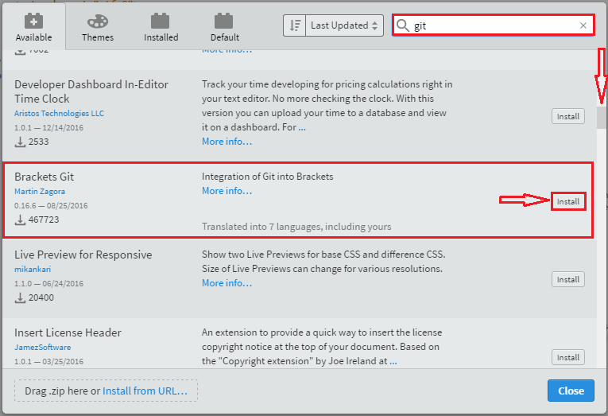
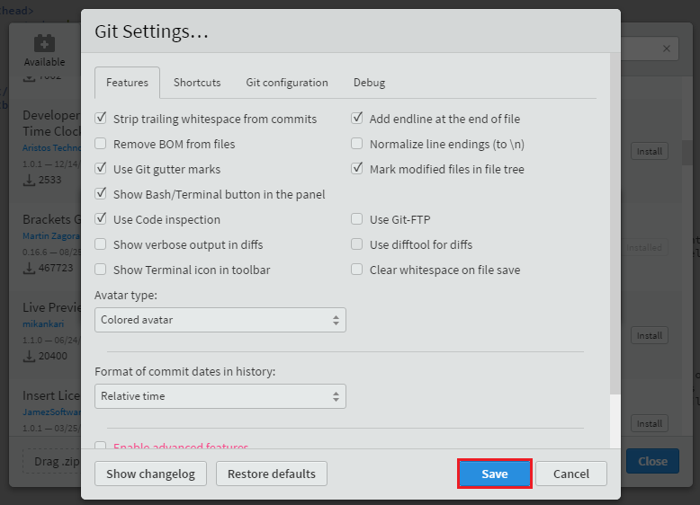
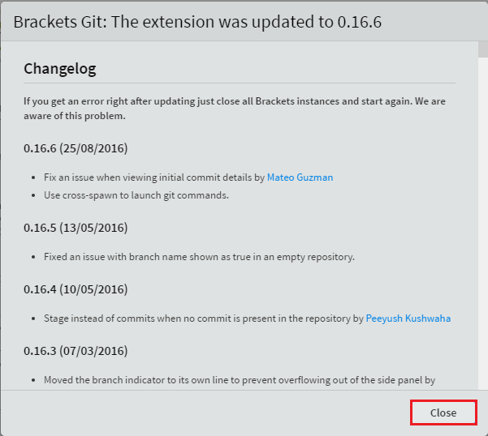
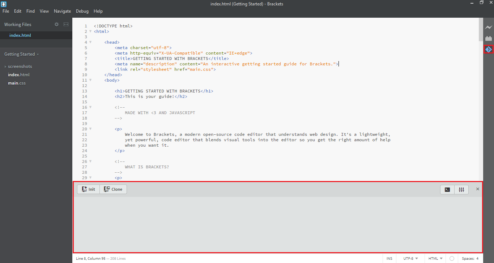

# 오라클 클라우드 테스트 드라이브 #
-----
## 클라우드 테스트 드라이브 용 브래킷 설치 ##

brackets는 현대적인 텍스트 편집기로, 집중적 인 시각 도구 및 전처리 지원을 통해 브라우저에서 쉽게 디자인 할 수 있습니다. 자세한 내용은 [Brackets.io](http://brackets.io/)을 참조하십시오. 

#### 브래킷 설치 

- [Brackets Home Page](http://brackets.io/)로 가서 가운데에있는 `Brackets 1.X 다운로드`버튼을 클릭하십시오. 

- 이 지침은**Microsoft Windows 호스트**를 예로 가정하지만 다른 OS에서도 비슷해야합니다. 설치 프로그램 실행 파일을 하드 디스크 대상에 저장하려면 선택하십시오. 

- 설치 파일을 실행합니다. 

- `Brackets.Release.1.10.msi`가 저장된 곳의 하드 디스크 디렉토리에서 열고 설치 프로그램을 실행하십시오. 대상 brackets 대상 폴더를 선택하고 `다음`버튼을 클릭하십시오. 

- `설치`버튼을 클릭하여 설치를 진행하십시오. 

- 브래킷 설치는 1 분 안에 완료해야합니다. `마침`버튼을 클릭하여 설치를 완료하십시오. 

- 브라켓 설치 위치 또는*Windows*검색 (Win10)에서 Brackets.exe를 실행하십시오. 

- 브래킷은 다음과 같이 시작해야합니다. 

- 오른쪽 상단의 `Extension Manager`아이콘을 클릭하십시오. 

- 검색 영역에`git`을 입력하고 스크롤하여`Brackets Git`을 찾은 다음 오른쪽에있는`Install` 버튼을 클릭하십시오. 

- 간단히`저장 `을 클릭하여 기본 **Bracket 설정 ...**을 수락하십시오. 

- `OK`버튼을 클릭하여 다시 시작하면 brackets가 단독으로 다시 시작됩니다. 

- 재시작이 끝나면 `닫기`버튼을 클릭하여 로그 변경 대화 상자를 닫습니다. 

- Git 교환 기능으로 brackets를 성공적으로 설치했습니다. 

## [DevOps Lab02로 이동합니다](02_DevOpsLab.md) 

