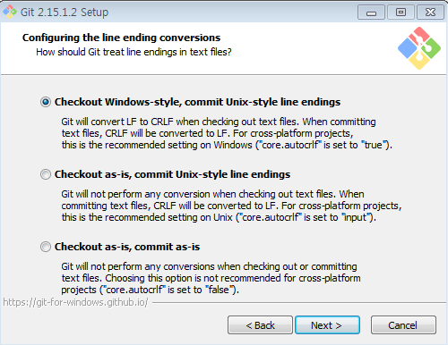

## Git 클라이언트 설치 ##

Git은 컴퓨터 파일의 변경 사항을 추적하고 여러 사람 사이의 파일에 대한 작업을 조정하는 버전 제어 시스템입니다. 주로 소프트웨어 개발의 소스 코드 관리에 사용되지만 [8], 모든 파일 세트의 변경 내용을 추적하는 데 사용할 수 있습니다. 

## 소프트웨어 다운로드
-  다음 url에서 각자의 OS에 맞는 git을 download 합니다.
- https://git-scm.com/download

## 소프트웨어 설치
다음의 설치 과정은 Windows를 기반으로 설명하지만 다른 OS에서도 비슷한 설치 과정을 거칩니다.

- [예]를 클릭하여 설치를 계속합니다. 

- 라이센스를 수락하려면 [다음]을 클릭하십시오. 

- 설치를위한 대상 폴더를 제공하십시오 - **기본값이 권장됩니다** 그리고 [다음]을 클릭하십시오. 

- 설치할 구성 요소를 선택할 수 있습니다.**기본**을 유지하고 [다음]을 클릭하십시오. 

- 시작 메뉴 폴더 이름을 제공 할 수 있습니다.**기본**을 유지하고 [다음] 

- Windows 명령 프롬프트에서 **Use Git from the windows Command Prompt**를 선택하고 [다음]을 클릭하십시오. 

- 원하는 SSL 라이브러리를 선택하십시오 - **기본값**을 유지하고 [다음] 

- CRLF 스타일에 대해 **기본값**을 유지하고 [다음] 

- 터미널 에뮬레이터의 **기본**을 유지하고 [다음] 

- 추가 옵션을 보려면 **기본**을 유지하고 [설치] 

- 설치가 완료 될 때까지 기다립니다. 

- 완료되면 [마침]을 클릭하십시오. 

[DevOps Lab02로 이동합니다](02_DevOpsLab.md) 

